# Wiki Documentation for https://github.com/SAZO-KR/naver-parser

Generated on: 2025-08-29 17:13:38

## Table of Contents

- [Project Overview](#page-home)
- [Getting Started](#page-getting-started)
- [System Architecture Overview](#page-architecture-overview)
- [API Endpoints](#page-api-endpoints)
- [Browser Queue Management](#page-browser-queue)
- [Naver Scraping Logic](#page-naver-scraping)
- [Cookie Management](#page-cookie-management)
- [Deployment with PM2](#page-deployment-pm2)
- [Configuration](#page-configuration)

<a id='page-home'></a>

## Project Overview

### Related Pages

Related topics: [Getting Started](#page-getting-started), [System Architecture Overview](#page-architecture-overview)

<details>
<summary>Relevant source files</summary>
The following files were used as context for generating this wiki page:

- [CLAUDE.md](https://github.com/SAZO-KR/naver-parser/blob/main/CLAUDE.md)
- [package.json](https://github.com/SAZO-KR/naver-parser/blob/main/package.json)
- [src/scrape.ts](https://github.com/SAZO-KR/naver-parser/blob/main/src/scrape.ts)
- [src/browser-queue-naver.ts](https://github.com/SAZO-KR/naver-parser/blob/main/src/browser-queue-naver.ts)
- [ecosystem.config.js](https://github.com/SAZO-KR/naver-parser/blob/main/ecosystem.config.js)
- [src/browser-queue.ts](https://github.com/SAZO-KR/naver-parser/blob/main/src/browser-queue.ts)

</details>

# Project Overview

This project is a web scraping service specifically designed for Naver's e-commerce platform. Built with TypeScript, Node.js, and Puppeteer, it provides an HTTP API to perform browser automation tasks for data extraction. The system is architected to handle concurrent requests efficiently, manage browser resources, and implement strategies to bypass Naver's anti-bot mechanisms.

The core of the service is a queue-based system that manages a pool of headless Chrome browser instances. It exposes several API endpoints for scraping URLs, checking redirects, and monitoring browser status. Process management and logging are handled by PM2, ensuring service reliability and maintainability in a production environment.

Sources: [CLAUDE.md]()

## Architecture

The system's architecture is centered around an Express.js API server that acts as the entry point for scraping requests. These requests are funneled into a browser queue system, which distributes the scraping tasks among a pool of managed Puppeteer browser instances. This design allows for concurrent processing while controlling resource usage.

Sources: [CLAUDE.md]()

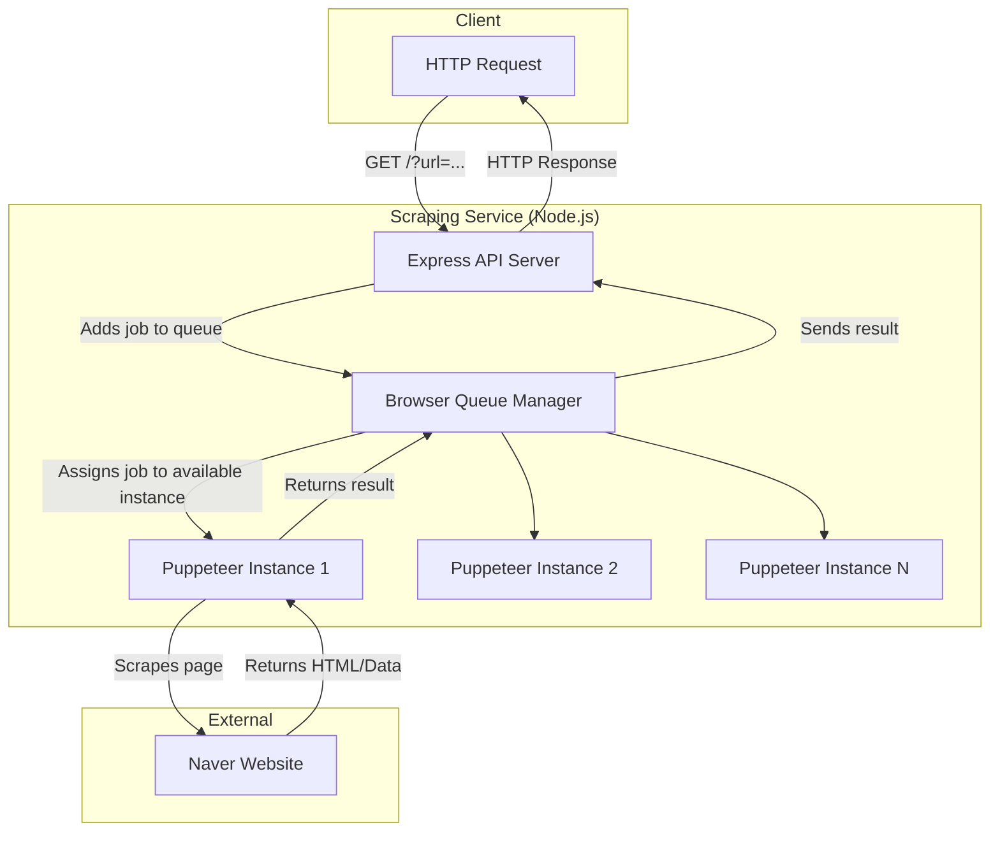
```mermaid
graph TD
    subgraph "Client"
        A[HTTP Request]
    end

    subgraph "Scraping Service (Node.js)"
        B[Express API Server]
        C[Browser Queue Manager]
        D1[Puppeteer Instance 1]
        D2[Puppeteer Instance 2]
        Dn[Puppeteer Instance N]
    end

    subgraph "External"
        E[Naver Website]
    end

    A -- "GET /?url=..." --> B
    B -- "Adds job to queue" --> C
    C -- "Assigns job to available instance" --> D1
    D1 -- "Scrapes page" --> E
    E -- "Returns HTML/Data" --> D1
    D1 -- "Returns result" --> C
    C -- "Sends result" --> B
    B -- "HTTP Response" --> A

    C --> D2
    C --> Dn
```
*A high-level overview of the scraping request flow.*
Sources: [CLAUDE.md](), [src/scrape.ts]()

### Core Components

The service is composed of several key components that work together to provide a robust scraping solution.

| Component | Description | Source File(s) |
| --- | --- | --- |
| **Web Scraping API** | An Express server on port 3000 that exposes endpoints for scraping and health checks. | `src/scrape.ts` |
| **Browser Queue System** | Manages a pool of Puppeteer browser instances, handles concurrent requests with a queue, and implements browser rotation. | `src/browser-queue-naver.ts` |
| **Cookie Management** | Automatically loads Naver authentication cookies from JSON files and uses the Chrome DevTools Protocol (CDP) for manipulation. | `CLAUDE.md` |
| **Rate Limiting** | Throttles incoming requests using `express-rate-limit` to prevent abuse. | `src/scrape.ts`, `CLAUDE.md` |
| **Process Management** | Uses PM2 for running the application in production, including auto-restarts on high memory usage and log rotation. | `ecosystem.config.js` |

Sources: [CLAUDE.md]()

## Web Scraping API

The primary interface to the service is a RESTful API built with Express.js. It listens on port 3000 and provides endpoints to initiate scraping tasks.

Sources: [CLAUDE.md:16](), [src/scrape.ts]()

### API Endpoints

| Method | Endpoint | Query Parameters | Description |
| --- | --- | --- | --- |
| `GET` | `/` | `url: string` | The main endpoint for scraping a given URL. It returns the page's HTML content and custom headers with metadata. |
| `GET` | `/health` | - | A health check endpoint that returns the status of the browser manager. |
| `GET` | `/check-naver-redirect` | `url: string` | Specifically handles and checks for Naver redirects. |
| `GET` | `/scrape-detail` | `url: string` | An alternative scraping endpoint that returns data in a JSON object. |
| `GET` | `/browsers` | - | Returns the status of the managed browser instances. |

Sources: [src/scrape.ts:13-94](), [CLAUDE.md:17-20]()

## Naver Scraping Mechanism

To reliably scrape Naver's e-commerce pages, which are often protected by anti-bot measures, the service employs a specialized scraping strategy. Instead of just fetching the HTML, it intercepts network requests made by the page to capture the underlying product data API calls.

Sources: [src/browser-queue-naver.ts](), [src/browser-queue.ts](), [src/browser-queue-proxy.ts]()

### API Interception Flow

When a request for a Naver Smartstore or Brand page is received, the `naverScrape` method is invoked. This method sets up request interception on the Puppeteer page to listen for specific API calls that fetch product details. If the initial page load does not trigger the API call, the system simulates user interaction by clicking on the page and reloading it to trigger the data fetch.

The following diagram illustrates the sequence for capturing Naver product data.

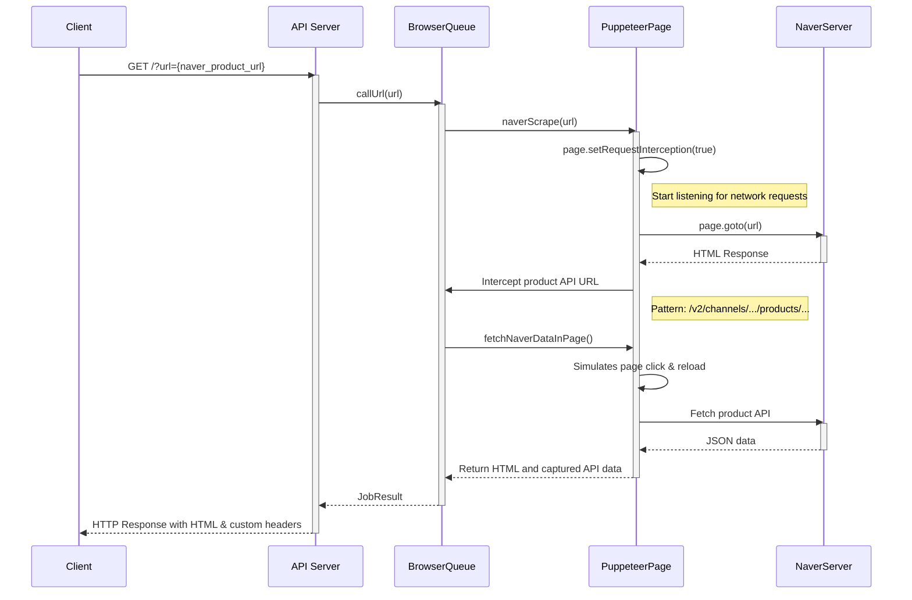
```mermaid
sequenceDiagram
    participant Client
    participant API Server
    participant BrowserQueue
    participant PuppeteerPage
    participant NaverServer

    Client->>API Server: GET /?url={naver_product_url}
    activate API Server
    API Server->>BrowserQueue: callUrl(url)
    activate BrowserQueue
    BrowserQueue->>PuppeteerPage: naverScrape(url)
    activate PuppeteerPage
    PuppeteerPage->>PuppeteerPage: page.setRequestInterception(true)
    Note right of PuppeteerPage: Start listening for network requests
    PuppeteerPage->>NaverServer: page.goto(url)
    activate NaverServer
    NaverServer-->>PuppeteerPage: HTML Response
    deactivate NaverServer
    PuppeteerPage->>BrowserQueue: Intercept product API URL
    Note right of PuppeteerPage: Pattern: /v2/channels/.../products/...
    BrowserQueue->>PuppeteerPage: fetchNaverDataInPage()
    PuppeteerPage->>PuppeteerPage: Simulates page click & reload
    PuppeteerPage->>NaverServer: Fetch product API
    activate NaverServer
    NaverServer-->>PuppeteerPage: JSON data
    deactivate NaverServer
    PuppeteerPage-->>BrowserQueue: Return HTML and captured API data
    deactivate PuppeteerPage
    BrowserQueue-->>API Server: JobResult
    deactivate BrowserQueue
    API Server-->>Client: HTTP Response with HTML & custom headers
    deactivate API Server
```
*Sequence diagram of the Naver-specific scraping logic.*
Sources: [src/browser-queue-naver.ts:241-356](), [src/browser-queue.ts:285-397]()

### Anti-Bot Evasion

The system includes specific logic to handle Naver's client-side integrity checks. It intercepts POST requests to `/ambulance/vitals` and modifies the payload on-the-fly to ensure the `rating` is always reported as `"good"`, preventing the page from flagging the session as a bot.

```javascript
// src/browser-queue-proxy.ts:126-133
page.on("request", (req: any) => {
    // ...
    if (pathname.endsWith("/ambulance/vitals")){
      try{
        const vitalData = JSON.parse(req.postData());
        if (vitalData["data"] && vitalData["data"]["rating"] !== "good") {
          vitalData["data"]["rating"] = "good";
        }
        req.continue(JSON.stringify(vitalData));
// ...
```
Sources: [src/browser-queue-proxy.ts:126-133](), [src/browser-queue.ts:342-349]()

## Process Management and Configuration

The application is designed to run as a persistent service using PM2, a process manager for Node.js. The configuration ensures reliability and simplifies operational tasks.

Sources: [ecosystem.config.js](), [package.json]()

### PM2 Configuration

The `ecosystem.config.js` file defines how the `scrape` application should be run by PM2.

| Parameter | Value | Description |
| --- | --- | --- |
| `name` | `'scrape'` | The name of the process in PM2. |
| `script` | `'dist/scrape.js'` | The entry point script for the application. |
| `instances` | `1` | The number of application instances to run. |
| `exec_mode` | `'fork'` | The execution mode for the application. |
| `max_memory_restart`| `'800M'` | Automatically restarts the process if it exceeds 800MB of memory. |
| `log_file` | `logs/log_file.log` | Path to the combined log file. |
| `out_file` | `logs/out_file.log` | Path for standard output logs. |
| `error_file` | `logs/error_file.log` | Path for error logs. |
| `log_date_format` | `'YYYY-MM-DD HH:mm:ss'` | The format for timestamps in logs. |

Sources: [ecosystem.config.js:12-26]()

### Key Dependencies

The project relies on several key npm packages to function.

| Package | Purpose |
| --- | --- |
| `puppeteer` | Provides the core browser automation and scraping capabilities via a high-level API to control headless Chrome. |
| `express` | A web application framework for Node.js used to build the HTTP API server. |
| `pm2` | A process manager for Node.js applications that handles logging, monitoring, and auto-restarts. |
| `express-rate-limit` | Middleware used for rate-limiting incoming requests to the API. |
| `typescript` | The programming language used for the project, providing static typing for JavaScript. |

Sources: [package.json:20-42]()

### Development Commands

The `package.json` file contains several scripts to streamline development, deployment, and management tasks.

| Command | Description |
| --- | --- |
| `yarn build` | Compiles the TypeScript source code into JavaScript. |
| `yarn dev:scrape` | Runs the main scraping server (`scrape.ts`) in development mode with `nodemon` for auto-reloading. |
| `yarn start` | Builds the project and starts it with PM2 using the `ecosystem.config.js` configuration. |
| `yarn stop` | Stops the `scrape` process managed by PM2. |
| `yarn show` | Displays details about the `scrape` process in PM2. |
| `yarn update` | Pulls the latest changes from git, installs dependencies, and restarts the service. |

Sources: [package.json:6-18]()

---

<a id='page-getting-started'></a>

## Getting Started

### Related Pages

Related topics: [Project Overview](#page-home), [Deployment with PM2](#page-deployment-pm2)

<details>
<summary>Relevant source files</summary>

The following files were used as context for generating this wiki page:

- [CLAUDE.md](https://github.com/SAZO-KR/naver-parser/blob/main/CLAUDE.md)
- [package.json](https://github.com/SAZO-KR/naver-parser/blob/main/package.json)
- [ecosystem.config.js](https://github.com/SAZO-KR/naver-parser/blob/main/ecosystem.config.js)
- [src/scrape.ts](https://github.com/SAZO-KR/naver-parser/blob/main/src/scrape.ts)
- [src/browser-queue.ts](https://github.com/SAZO-KR/naver-parser/blob/main/src/browser-queue.ts)
- [src/browser-queue-naver.ts](https://github.com/SAZO-KR/naver-parser/blob/main/src/browser-queue-naver.ts)
- [src/browser-queue-proxy.ts](https://github.com/SAZO-KR/naver-parser/blob/main/src/browser-queue-proxy.ts)
</details>

# Getting Started

This document provides a comprehensive guide to setting up, configuring, and running the `naver-parser` project. The project is a web scraping service built with TypeScript, Node.js, and Puppeteer, specifically designed to parse Naver's e-commerce platform. It exposes an HTTP API to perform scraping tasks using a managed pool of browser instances.

The core of the system is a browser queue that manages concurrent requests, handles browser rotation, and implements specialized logic for Naver's anti-bot measures. The service is managed in production using PM2, with configurations for auto-restarts and log rotation.

Sources: [CLAUDE.md]()

## Architecture Overview

The service operates around three main components: an Express.js API server, a browser queue system, and Puppeteer for browser automation. When a scrape request is received, the API server passes the URL to the browser queue, which assigns the job to an available Puppeteer instance. This instance then navigates to the page, intercepts network requests to capture specific Naver API data, and returns the final HTML content.

Sources: [CLAUDE.md:11-23](), [src/scrape.ts:49-65]()

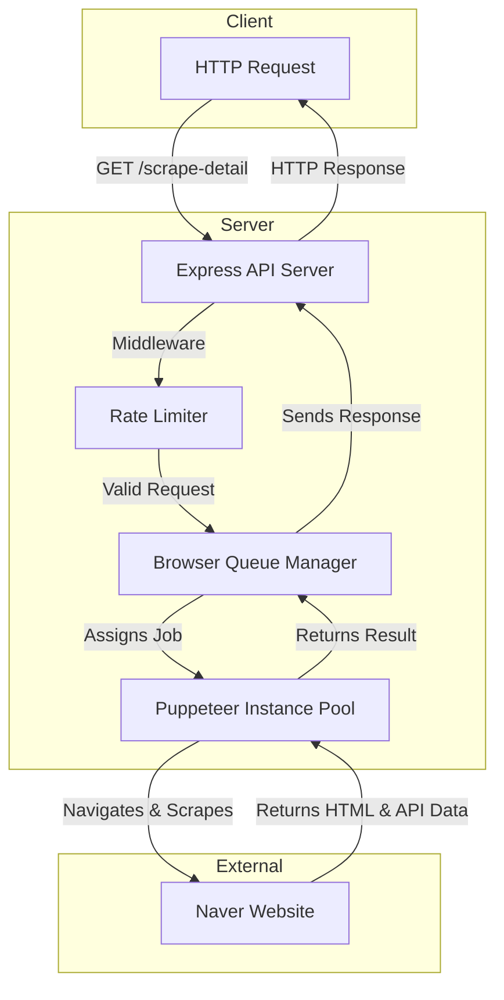
```mermaid
graph TD
    subgraph Client
        A[HTTP Request]
    end

    subgraph Server
        B[Express API Server]
        C[Rate Limiter]
        D[Browser Queue Manager]
        E[Puppeteer Instance Pool]
    end

    subgraph External
        F[Naver Website]
    end

    A -- GET /scrape-detail --> B
    B -- Middleware --> C
    C -- Valid Request --> D
    D -- Assigns Job --> E
    E -- Navigates & Scrapes --> F
    F -- Returns HTML & API Data --> E
    E -- Returns Result --> D
    D -- Sends Response --> B
    B -- HTTP Response --> A
```
*A high-level overview of the request flow from the client to the Naver website and back.*
Sources: [CLAUDE.md:11-23](), [src/scrape.ts](), [src/browser-queue.ts]()

## Installation and Setup

### Prerequisites

| Dependency | Command |
| :--- | :--- |
| Node.js | `nvm use` or install a compatible version |
| Yarn | `npm install -g yarn` |

### Installation Steps

1.  **Clone the repository:**
    ```bash
    git clone https://github.com/SAZO-KR/naver-parser.git
    cd naver-parser
    ```
2.  **Install dependencies:**
    ```bash
    yarn install
    ```
    This command installs all required packages listed in `package.json`, including `express`, `puppeteer`, and `pm2`.

    Sources: [package.json:17-36](), [CLAUDE.md:31]()

3.  **Place Cookie Files:**
    For authenticated scraping, Naver authentication cookies must be placed in the `cookies/` directory. The files must follow the naming convention `naver-cookies-*.json`.

    Sources: [CLAUDE.md:25-27](), [CLAUDE.md:61]()

## Running the Application

The application can be run in development or production mode using scripts defined in `package.json`. Production environments are managed by PM2.

Sources: [package.json:6-15](), [CLAUDE.md:30-55]()

### Key Scripts

| Command | Description |
| :--- | :--- |
| `yarn dev:scrape` | Runs the scraping server (`scrape.ts`) in development mode with `nodemon`. |
| `yarn build` | Compiles the TypeScript source code to JavaScript in the `dist/` directory. |
| `yarn start` | Builds the project and starts the `scrape` application using PM2 as defined in `ecosystem.config.js`. |
| `yarn stop` | Stops the PM2 `scrape` process. |
| `yarn update` | Pulls the latest changes from git, installs dependencies, and restarts the PM2 service. |
| `pm2 logs scrape` | Views the logs for the `scrape` process. |

Sources: [package.json:6-15](), [CLAUDE.md:30-55]()

### Process Management with PM2

PM2 is used to daemonize, monitor, and manage the application in a production environment. The configuration is defined in `ecosystem.config.js`.

Key PM2 features configured:
*   **Auto Restart**: The application will automatically restart if it crashes.
*   **Max Memory Restart**: The process will restart if its memory usage exceeds 800MB.
*   **Log Management**: Output, error, and combined logs are stored in the `logs/` directory.

```javascript
// ecosystem.config.js
module.exports = {
  apps: [
    {
      name: 'scrape',
      script: 'dist/scrape.js',
      instances: 1,
      exec_mode: 'fork',
      log_file: path.join(__dirname, "logs", "log_file.log"),
      out_file: path.join(__dirname, "logs", "out_file.log"),
      error_file: path.join(__dirname, "logs", "error_file.log"),
      log_date_format: 'YYYY-MM-DD HH:mm:ss',
      autorestart: true,
      watch: false,
      max_memory_restart: '800M',
    }
  ],
}
```
*This configuration ensures the stability and maintainability of the service in production.*
Sources: [ecosystem.config.js:12-28](), [CLAUDE.md:28-29]()

## Configuration

| Parameter | Type | Default | Description | Source File |
| :--- | :--- | :--- | :--- | :--- |
| `INSTANCE_NUMBER` | Environment Variable | 4 | Number of concurrent Puppeteer browser instances to run. | [CLAUDE.md:57]() |
| `PORT` | Hardcoded | 3000 | The port on which the Express API server listens. | [CLAUDE.md:58]() |
| `max_memory_restart` | PM2 Config | '800M' | Memory limit before PM2 restarts the application. | [ecosystem.config.js:26]() |

## API Endpoints

The service exposes several HTTP endpoints for scraping and management.

Sources: [src/scrape.ts:16-95]()

| Method | Endpoint | Description |
| :--- | :--- | :--- |
| `GET` | `/` | Main scraping endpoint. Requires a `url` query parameter. (Note: The code shows this endpoint but `scrape-detail` appears to be the primary one used). |
| `GET` | `/scrape-detail` | Scrapes the provided `url` and returns the page HTML and additional metadata in headers. |
| `GET` | `/check-naver-redirect` | Checks for redirects on a given Naver URL. |
| `GET` | `/browsers` | Returns the status of the managed browser instances. |
| `GET` | `/health` | A health check endpoint that returns "OK". |

### Request Flow for `/scrape-detail`

The following diagram illustrates the sequence of events when a client requests to scrape a Naver product page.

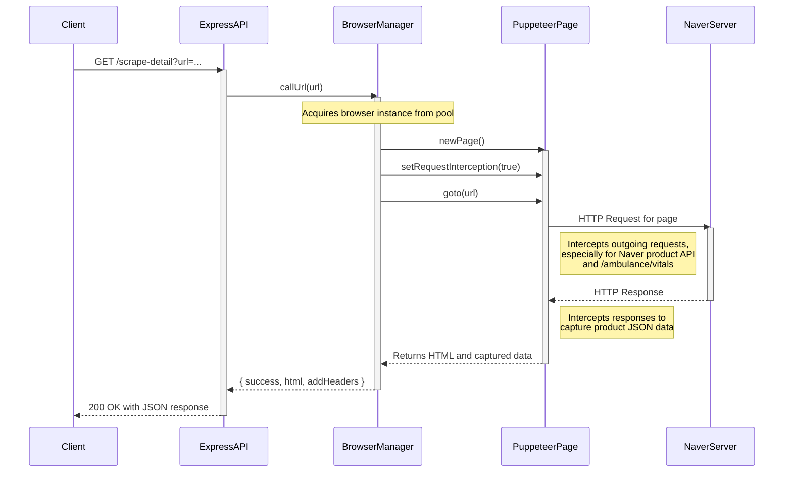
```mermaid
sequenceDiagram
    participant Client
    participant ExpressAPI
    participant BrowserManager
    participant PuppeteerPage
    participant NaverServer

    Client->>ExpressAPI: GET /scrape-detail?url=...
    activate ExpressAPI
    ExpressAPI->>BrowserManager: callUrl(url)
    activate BrowserManager
    Note over BrowserManager: Acquires browser instance from pool
    BrowserManager->>PuppeteerPage: newPage()
    activate PuppeteerPage
    BrowserManager->>PuppeteerPage: setRequestInterception(true)
    BrowserManager->>PuppeteerPage: goto(url)
    PuppeteerPage->>NaverServer: HTTP Request for page
    activate NaverServer
    Note right of PuppeteerPage: Intercepts outgoing requests,<br/>especially for Naver product API<br/>and /ambulance/vitals
    NaverServer-->>PuppeteerPage: HTTP Response
    deactivate NaverServer
    Note right of PuppeteerPage: Intercepts responses to<br/>capture product JSON data
    PuppeteerPage-->>BrowserManager: Returns HTML and captured data
    deactivate PuppeteerPage
    BrowserManager-->>ExpressAPI: { success, html, addHeaders }
    deactivate BrowserManager
    ExpressAPI-->>Client: 200 OK with JSON response
    deactivate ExpressAPI
```
*This sequence shows how `browserManager` uses Puppeteer to not only fetch the HTML but also intercept network traffic to extract valuable API data during page load.*
Sources: [src/scrape.ts:49-65](), [src/browser-queue.ts:208-228](), [src/browser-queue-naver.ts:178-204]()

## Core Scraping Logic

The service employs specialized logic for scraping Naver Smartstore and Brand pages to bypass anti-bot measures and reliably extract product data.

Sources: [src/browser-queue.ts:222-226]()

### Naver API Interception

For Naver product pages, the primary goal is to capture the JSON data from an internal API call that the page makes, rather than just parsing the HTML.

1.  **Request Interception**: Puppeteer is configured to intercept all network requests.
2.  **URL Pattern Matching**: The system looks for a request URL matching the pattern `^\/.+?\/v2\/channels\/[^/]+\/products\/\d+$`. This is Naver's product detail API.
3.  **Data Capture**: When a response to this URL is detected with a content type of `application/json`, its body is captured and stored.
4.  **Retry Mechanism**: If the API data is not captured on the first load, the system will trigger a click on the page and a reload to attempt to trigger the API call again.

This process ensures that the structured product data is obtained, which is more reliable than screen scraping.

```mermaid
flowchart TD
    Start[Start naverScrape] --> A[Pre-set Page Config]
    A --> B{Set Request<br>Interception}
    B --> C[page.goto(url)]
    C --> D{Intercept Request?<br>Is it Product API?}
    D -- Yes --> E[Store API URL]
    D -- No --> C
    C --> F{Intercept Response?<br>Is it Product API?}
    F -- Yes --> G[Store API JSON Data]
    F -- No --> C
    C --> H{Page Load Complete}
    H --> I{API Data Captured?}
    I -- No --> J[fetchNaverDataInPage]
    J --> K[Simulate Click & Reload]
    K --> H
    I -- Yes --> L[Return HTML & API Data]
    L --> End[End]
```
*Flowchart illustrating the process of intercepting Naver's internal product API during a page scrape.*
Sources: [src/browser-queue.ts:241-267](), [src/browser-queue-naver.ts:206-250](), [src/browser-queue-naver.ts:81-115]()

### Anti-Bot Evasion

The scraper implements a specific technique to handle Naver's client-side monitoring.

-   It intercepts POST requests to `/ambulance/vitals`.
-   It parses the JSON payload of this request.
-   If the `rating` field is not `"good"`, it modifies the payload to set `rating` to `"good"` before allowing the request to continue.

This manipulation helps prevent the scraper from being flagged as an automated bot.

Sources: [src/browser-queue.ts:262-271](), [src/browser-queue-proxy.ts:2-8](), [src/browser-cluster-20250428.ts:106-115]()

---

<a id='page-architecture-overview'></a>

## System Architecture Overview

### Related Pages

Related topics: [API Endpoints](#page-api-endpoints), [Browser Queue Management](#page-browser-queue)

<details>
<summary>Relevant source files</summary>
The following files were used as context for generating this wiki page:

- [CLAUDE.md](https://github.com/SAZO-KR/naver-parser/blob/main/CLAUDE.md)
- [src/scrape.ts](https://github.com/SAZO-KR/naver-parser/blob/main/src/scrape.ts)
- [src/browser-queue-naver.ts](https://github.com/SAZO-KR/naver-parser/blob/main/src/browser-queue-naver.ts)
- [src/browser-queue.ts](https://github.com/SAZO-KR/naver-parser/blob/main/src/browser-queue.ts)
- [ecosystem.config.js](https://github.com/SAZO-KR/naver-parser/blob/main/ecosystem.config.js)
</details>

# System Architecture Overview

This document provides a technical overview of the `naver-parser` system, a web scraping service built with TypeScript, Node.js, and Puppeteer. The system is specifically designed to provide an HTTP API for browser-automated scraping, with optimizations for Naver's e-commerce platform. It features a robust browser management system, specialized scraping logic, and production-ready process management.

Sources: [CLAUDE.md]()

## Core Components

The system is composed of several key components that work together to handle concurrent scraping requests efficiently and reliably.

| Component | Description | Source File |
| :--- | :--- | :--- |
| **Web Scraping API** | An Express.js server that exposes HTTP endpoints for initiating scraping tasks. | `src/scrape.ts` |
| **Browser Queue System** | Manages a pool of Puppeteer browser instances to process scraping jobs concurrently. It handles browser rotation and resource management. | `src/browser-queue-naver.ts` |
| **Cookie Management** | Automatically loads and manages Naver authentication cookies from the `cookies/` directory using the Chrome DevTools Protocol (CDP). | `src/utils/cdp-cookie-controller.ts` |
| **Rate Limiting** | Throttles incoming requests to the API using the `express-rate-limit` middleware to prevent abuse. | `src/utils/request-limiter.ts` |
| **Process Management** | Uses PM2 for running the application in a production environment, handling auto-restarts, and managing logs. | `ecosystem.config.js` |

Sources: [CLAUDE.md]()

### High-Level Architecture Diagram

The following diagram illustrates the interaction between the main components of the system.

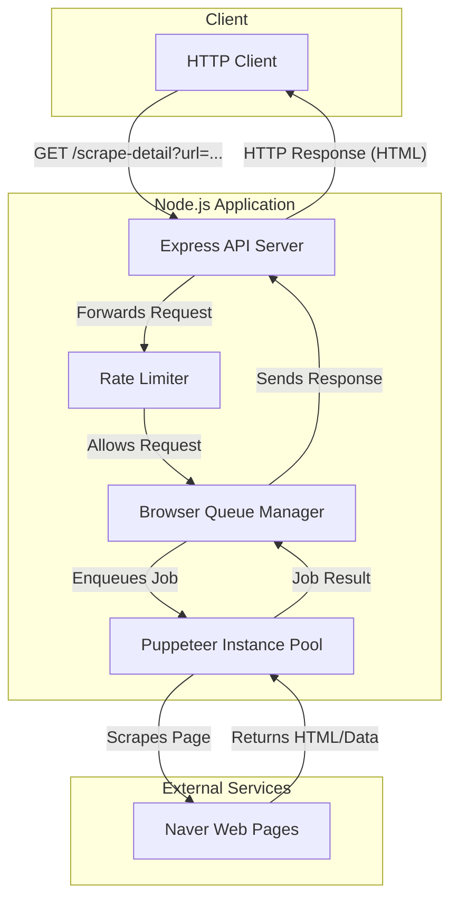
```mermaid
graph TD
    subgraph "Client"
        A[HTTP Client]
    end

    subgraph "Node.js Application"
        B[Express API Server]
        C[Rate Limiter]
        D[Browser Queue Manager]
        E[Puppeteer Instance Pool]
    end

    subgraph "External Services"
        F[Naver Web Pages]
    end

    A -- "GET /scrape-detail?url=..." --> B
    B -- "Forwards Request" --> C
    C -- "Allows Request" --> D
    D -- "Enqueues Job" --> E
    E -- "Scrapes Page" --> F
    F -- "Returns HTML/Data" --> E
    E -- "Job Result" --> D
    D -- "Sends Response" --> B
    B -- "HTTP Response (HTML)" --> A
```

This diagram shows a client making a request to the Express API, which is then processed by the browser queue manager that utilizes a pool of Puppeteer instances to perform the actual scraping.

Sources: [CLAUDE.md](), [src/scrape.ts:46-68]()

## Web Scraping API

The service exposes an HTTP API built with Express.js, running on port 3000. This API serves as the primary entry point for all scraping tasks.

Sources: [CLAUDE.md](), [src/scrape.ts]()

### API Endpoints

| Method | Endpoint | Query Parameters | Description |
| :--- | :--- | :--- | :--- |
| `GET` | `/` | `url: string` | The main endpoint for scraping a given URL. This is an alias for `/scrape-detail`. |
| `GET` | `/scrape-detail` | `url: string` | Initiates a scraping job for the specified URL using the browser queue. Returns the page HTML and custom `x-sazo-*` headers with metadata. |
| `GET` | `/health` | - | A health check endpoint. |
| `GET` | `/check-naver-redirect` | `url: string` | Specifically handles and checks for Naver redirects. |
| `GET` | `/browsers` | - | Returns information about the current state of the browser instances in the pool. |

Sources: [CLAUDE.md](), [src/scrape.ts:22-92]()

## Browser Management & Scraping Logic

The core of the application is its browser queue system, which manages Puppeteer instances to handle scraping jobs. It has specialized logic for handling Naver Smartstore and Brandstore pages differently from other websites.

Sources: [src/browser-queue.ts](), [src/browser-queue-naver.ts]()

### Job Execution Flow

When a URL is submitted to the API, the `BrowserManager`'s `callUrl` method enqueues the job. The system then assigns the job to an available browser instance.

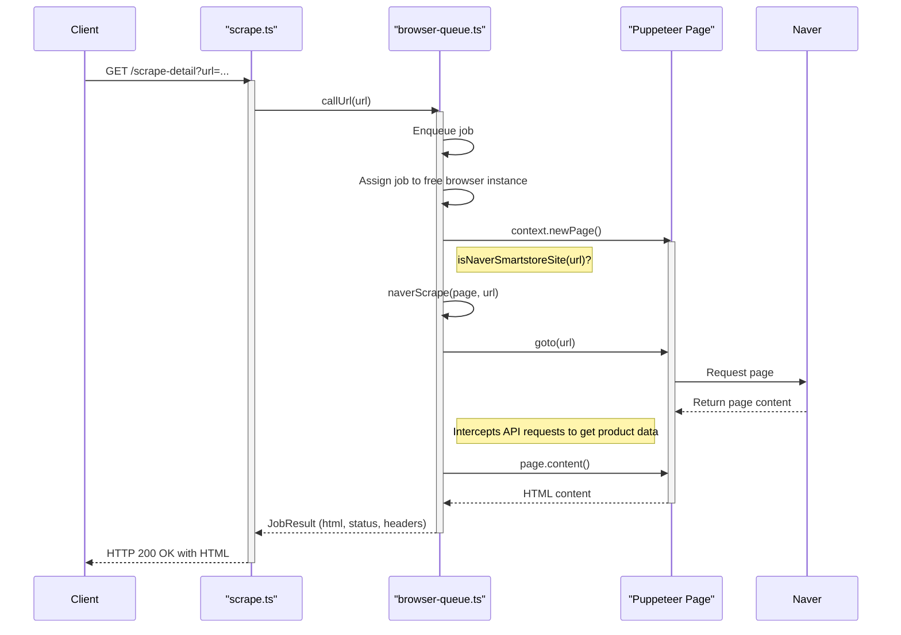
```mermaid
sequenceDiagram
    participant Client
    participant ExpressAPI as "scrape.ts"
    participant BrowserManager as "browser-queue.ts"
    participant PuppeteerPage as "Puppeteer Page"
    participant Naver

    Client->>ExpressAPI: GET /scrape-detail?url=...
    activate ExpressAPI
    ExpressAPI->>BrowserManager: callUrl(url)
    activate BrowserManager
    BrowserManager->>BrowserManager: Enqueue job
    BrowserManager->>BrowserManager: Assign job to free browser instance
    BrowserManager->>PuppeteerPage: context.newPage()
    activate PuppeteerPage
    Note right of BrowserManager: isNaverSmartstoreSite(url)?
    BrowserManager->>BrowserManager: naverScrape(page, url)
    BrowserManager->>PuppeteerPage: goto(url)
    PuppeteerPage->>Naver: Request page
    Naver-->>PuppeteerPage: Return page content
    Note right of BrowserManager: Intercepts API requests to get product data
    BrowserManager->>PuppeteerPage: page.content()
    PuppeteerPage-->>BrowserManager: HTML content
    deactivate PuppeteerPage
    BrowserManager-->>ExpressAPI: JobResult (html, status, headers)
    deactivate BrowserManager
    ExpressAPI-->>Client: HTTP 200 OK with HTML
    deactivate ExpressAPI
```

This sequence illustrates the process from receiving a request to returning the scraped content, highlighting the role of the `BrowserManager` in orchestrating the Puppeteer instance.

Sources: [src/scrape.ts:52-55](), [src/browser-queue.ts:60-72]()

### Naver Scraping Logic (`naverScrape`)

For URLs identified as Naver Smartstore or Brandstore pages, a specialized `naverScrape` method is invoked. This method employs advanced techniques to bypass anti-bot measures and capture dynamic product data.

The key steps are:
1.  **Page Pre-configuration**: Sets up the Puppeteer page with appropriate headers and settings.
2.  **Request Interception**: Listens for network requests made by the page.
    - It specifically looks for a product data API call matching the pattern `^\/.+?\/v2\/channels\/[^/]+\/products\/\d+$`.
    - It also intercepts and modifies `/ambulance/vitals` requests to ensure the `rating` is always `"good"`, likely to prevent bot detection.
3.  **Page Navigation**: Navigates to the target URL.
4.  **Data Capture**: Waits for the product data API request to be captured. The response body of this request is stored.
5.  **Retry Mechanism**: If the API data is not captured on the first load, it triggers a `fetchNaverDataInPage` function. This function simulates a user click on the main content area and then reloads the page to try and trigger the API call again.
6.  **Content Return**: Returns the full page HTML along with the captured API data and custom headers indicating the success of the operation.

Sources: [src/browser-queue-naver.ts:251-321](), [src/browser-queue.ts:168-240](), [src/browser-queue-proxy.ts:208-278]()

## Process and Resource Management

The application is designed to be run using PM2, a process manager for Node.js applications. The configuration is defined in `ecosystem.config.js`.

Sources: [ecosystem.config.js](), [package.json:9-12]()

### PM2 Configuration

The configuration ensures that the scraping service runs reliably with automatic restarts and log management.

| Parameter | Value | Description |
| :--- | :--- | :--- |
| `name` | `'scrape'` | The name of the process in PM2. |
| `script` | `'dist/scrape.js'` | The entry point script for the application after TypeScript compilation. |
| `instances` | `1` | The application runs as a single instance. |
| `exec_mode` | `'fork'` | The execution mode for the instance. |
| `max_memory_restart` | `'800M'` | PM2 will automatically restart the application if it exceeds 800MB of memory usage. |
| `autorestart` | `true` | The application will be automatically restarted if it crashes. |
| `log_file` | `logs/log_file.log` | Path for the combined log file. |
| `out_file` | `logs/out_file.log` | Path for standard output logs. |
| `error_file` | `logs/error_file.log` | Path for error logs. |

Sources: [ecosystem.config.js:10-25]()

The `package.json` file contains scripts to manage the PM2 process, such as `start`, `stop`, and `update`.

```json
"scripts": {
    "start": "yarn tsc && pm2 start ecosystem.config.js",
    "stop": "pm2 delete scrape",
    "show": "pm2 show scrape",
    "update": "git pull && yarn install && yarn stop && yarn start"
}
```

Sources: [package.json:9-14]()

---

<a id='page-api-endpoints'></a>

## API Endpoints

### Related Pages

Related topics: [System Architecture Overview](#page-architecture-overview)

<details>
<summary>Relevant source files</summary>
The following files were used as context for generating this wiki page:

- [src/scrape.ts](https://github.com/SAZO-KR/naver-parser/blob/main/src/scrape.ts)
- [src/main.ts](https://github.com/SAZO-KR/naver-parser/blob/main/src/main.ts)
- [src/browser-queue-naver.ts](https://github.com/SAZO-KR/naver-parser/blob/main/src/browser-queue-naver.ts)
- [ecosystem.config.js](https://github.com/SAZO-KR/naver-parser/blob/main/ecosystem.config.js)
- [CLAUDE.md](https://github.com/SAZO-KR/naver-parser/blob/main/CLAUDE.md)
</details>

# API Endpoints

This document provides a technical overview of the HTTP API endpoints exposed by the Naver Parser service. The API is built with Node.js and Express, designed to provide web scraping capabilities for Naver's e-commerce platform by leveraging a Puppeteer-based browser automation system.

The system is composed of two main services: a primary scraping application that handles the core logic and exposes the API endpoints, and a proxy layer that routes incoming traffic. The scraping service is managed and monitored by PM2.

Sources: [CLAUDE.md](), [src/scrape.ts](), [src/main.ts](), [ecosystem.config.js]()

## System Architecture

The API architecture consists of a public-facing proxy server and a backend scraping service. The proxy listens on port 80 and forwards requests to the scraping service, which runs on a different port and executes the browser automation tasks. This separation allows for cleaner request handling and logging.

The scraping service itself relies on a browser queue system to manage a pool of Puppeteer instances, ensuring concurrent requests are handled efficiently.

Sources: [src/main.ts](), [src/scrape.ts](), [CLAUDE.md]()

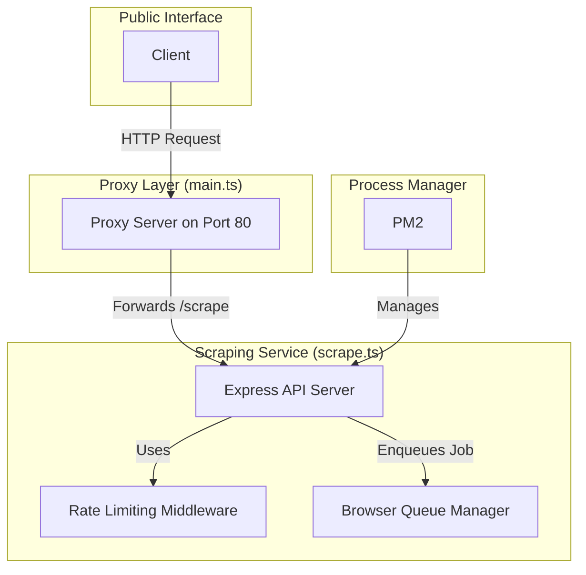
```mermaid
graph TD
    subgraph "Public Interface"
        Client[Client]
    end

    subgraph "Proxy Layer (main.ts)"
        ProxyServer[Proxy Server on Port 80]
    end

    subgraph "Scraping Service (scrape.ts)"
        direction TD
        APIServer[Express API Server]
        RateLimiter[Rate Limiting Middleware]
        BrowserManager[Browser Queue Manager]
    end

    subgraph "Process Manager"
        PM2[PM2]
    end

    Client -- HTTP Request --> ProxyServer
    ProxyServer -- Forwards /scrape --> APIServer
    APIServer -- Uses --> RateLimiter
    APIServer -- Enqueues Job --> BrowserManager
    PM2 -- Manages --> APIServer

```
*This diagram illustrates the high-level data flow from a client request through the proxy to the core scraping service, which is managed by PM2.*
Sources: [src/main.ts:22-25](), [src/scrape.ts:8-12](), [ecosystem.config.js:12](), [CLAUDE.md]()

## API Server (`scrape.ts`)

The core of the system is an Express application defined in `src/scrape.ts`. This server is responsible for defining the API routes, applying middleware like rate limiting, and interfacing with the browser management system (`BrowserQueueNaver`) to perform scraping tasks.

### Key Features

| Feature         | Implementation                                | Description                                                                 |
|-----------------|-----------------------------------------------|-----------------------------------------------------------------------------|
| Web Framework   | Express.js                                    | Handles HTTP requests and routing.                                          |
| Rate Limiting   | `express-rate-limit`                          | Throttles incoming requests to prevent abuse. Configured for 60 req/min.    |
| Scraping Logic  | `BrowserQueueNaver`                           | Manages Puppeteer browser instances and executes scraping jobs in a queue.  |
| Process Mgmt.   | PM2                                           | Runs the `scrape.js` script, with auto-restarts on memory limits (800M).      |

Sources: [src/scrape.ts:4-14](), [ecosystem.config.js:21](), [CLAUDE.md]()

## Endpoints

The API exposes several endpoints for different scraping and management tasks.

| Method | Path                      | Description                                                                                             |
|--------|---------------------------|---------------------------------------------------------------------------------------------------------|
| `GET`  | `/`                       | The main endpoint for scraping a web page. It returns the raw HTML content.                             |
| `GET`  | `/health`                 | A simple health check endpoint that returns "OK".                                                       |
| `GET`  | `/check-naver-redirect`   | Specifically designed to check for and handle redirects on Naver URLs.                                  |
| `GET`  | `/scrape-detail`          | A variant of the main scraping endpoint that returns the HTML content within a JSON object.             |
| `GET`  | `/browsers`               | An administrative endpoint to retrieve the current status and state of the managed browser instances.   |

Sources: [src/scrape.ts:16-97]()

### `GET /`

This is the primary endpoint for initiating a scrape job. It is rate-limited.

**Request Parameters**

| Parameter | Type   | Description                      | Required |
|-----------|--------|----------------------------------|----------|
| `url`     | string | The full URL of the page to scrape. | Yes      |

**Response**
-   On success, it returns the raw HTML content of the scraped page with a `200` status code.
-   It includes custom headers like `x-sazo-status` and `x-sazo-append` to provide additional metadata about the scrape job, such as the final URL, page title, and whether Naver-specific data was intercepted.
-   On failure, it returns a `500` status code with an error message.

**Request Flow**

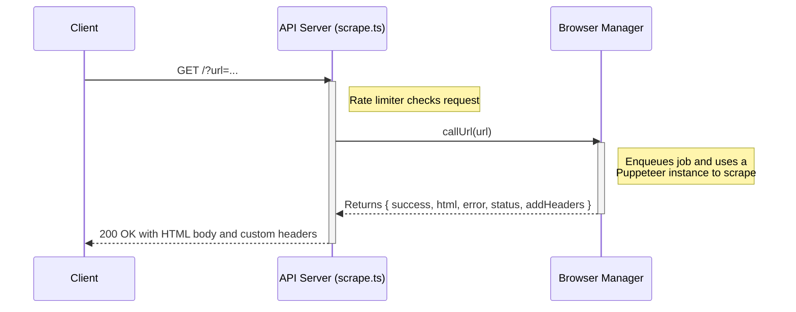
```mermaid
sequenceDiagram
    participant Client
    participant API Server (scrape.ts)
    participant Browser Manager

    Client->>API Server (scrape.ts): GET /?url=...
    activate API Server (scrape.ts)
    Note right of API Server (scrape.ts): Rate limiter checks request
    API Server (scrape.ts)->>Browser Manager: callUrl(url)
    activate Browser Manager
    Note right of Browser Manager: Enqueues job and uses a<br/>Puppeteer instance to scrape
    Browser Manager-->>API Server (scrape.ts): Returns { success, html, error, status, addHeaders }
    deactivate Browser Manager
    API Server (scrape.ts)-->>Client: 200 OK with HTML body and custom headers
    deactivate API Server (scrape.ts)
```
*This sequence shows a successful request to the main scraping endpoint.*
Sources: [src/scrape.ts:16-41](), [src/browser-queue-naver.ts:153-170]()

### `GET /health`

A simple endpoint to verify that the service is running.

-   **Path:** `/health`
-   **Method:** `GET`
-   **Response:** Returns a `200` status with the plain text body "OK".

Sources: [src/scrape.ts:44-46]()

### `GET /check-naver-redirect`

This endpoint is specialized for handling Naver URLs and determining their final destination after any redirects. It is also rate-limited.

-   **Path:** `/check-naver-redirect`
-   **Method:** `GET`
-   **Request Parameters:** Requires a `url` query parameter.
-   **Response:** Returns a JSON object with the result from the `scrapeNaverRedirect` manager.

Sources: [src/scrape.ts:49-66]()

### `GET /scrape-detail`

This endpoint is similar to the main `GET /` endpoint but formats the response differently.

-   **Path:** `/scrape-detail`
-   **Method:** `GET`
-   **Request Parameters:** Requires a `url` query parameter.
-   **Response:** Returns a `200` status with a JSON object: `{ "data": "<html>...</html>", "error": null }`. It also includes the `x-sazo-status` and `x-sazo-append` custom headers.

Sources: [src/scrape.ts:69-92]()

### `GET /browsers`

An administrative endpoint to inspect the state of the browser pool.

-   **Path:** `/browsers`
-   **Method:** `GET`
-   **Response:** Returns a JSON object containing information about the active browser instances managed by the `browserManager`.

Sources: [src/scrape.ts:94-97]()

## Proxy Layer (`main.ts`)

A separate proxy server is defined in `src/main.ts` to act as the public entry point.

-   **Functionality:** It listens on port 80 and forwards any requests made to the `/scrape` path to the internal scraping API server running on `http://localhost:3002`.
-   **Middleware:** It includes a logging middleware that assigns a unique ID to each request and logs the URL, query parameters, and final response status code.

```javascript
// File: src/main.ts:22-22
app.use('/scrape', logRequest, createProxyMiddleware({ target: 'http://localhost:3002', changeOrigin: true }));
```
*This code snippet shows the proxy middleware configuration.*
Sources: [src/main.ts:1-25]()

---

<a id='page-browser-queue'></a>

## Browser Queue Management

### Related Pages

Related topics: [System Architecture Overview](#page-architecture-overview), [Naver Scraping Logic](#page-naver-scraping)

<details>
<summary>Relevant source files</summary>

The following files were used as context for generating this wiki page:

- [src/browser-queue-naver.ts](https://github.com/SAZO-KR/naver-parser/blob/main/src/browser-queue-naver.ts)
- [src/browser-queue.ts](https://github.com/SAZO-KR/naver-parser/blob/main/src/browser-queue.ts)
- [src/scrape.ts](https://github.com/SAZO-KR/naver-parser/blob/main/src/scrape.ts)
- [src/pool/task-pool.ts](https://github.com/SAZO-KR/naver-parser/blob/main/src/pool/task-pool.ts)
- [src/browser-queue-proxy.ts](https://github.com/SAZO-KR/naver-parser/blob/main/src/browser-queue-proxy.ts)
- [src/browser-cluster-20250428.ts](https://github.com/SAZO-KR/naver-parser/blob/main/src/browser-cluster-20250428.ts)
- [CLAUDE.md](https://github.com/SAZO-KR/naver-parser/blob/main/CLAUDE.md)
</details>

# Browser Queue Management

The Browser Queue Management system is a core component of the Naver scraping service, designed to manage a pool of Puppeteer browser instances for handling concurrent scraping requests. It uses a queue-based architecture to process tasks, ensuring efficient resource utilization and stable performance. The system is primarily orchestrated by the `BrowserQueueManager` class, which coordinates a browser pool and a task queue to execute web scraping jobs. The active implementation is specialized for Naver's platform, incorporating specific logic to handle anti-bot measures and data extraction from Naver Smartstore and Brand Store pages.

This system is instantiated and used within the Express application defined in `scrape.ts` to serve scraping requests from various API endpoints.

Sources: [CLAUDE.md](), [src/scrape.ts:25](), [src/browser-queue-naver.ts]()

## Core Architecture

The system is composed of three main classes that work together to manage scraping tasks: `BrowserQueueManager`, `TaskQueueManager`, and `BrowserPoolManager`.

Sources: [src/browser-queue-naver.ts:63-75](), [src/pool/task-pool.ts:13-15]()

### Key Components

| Component | Description | Source File |
| :--- | :--- | :--- |
| **`BrowserQueueManager`** | The central orchestrator. It acts as a singleton, managing the lifecycle of scraping jobs, interacting with the task queue and browser pool, and containing the specific scraping logic. | `src/browser-queue-naver.ts` |
| **`TaskQueueManager`** | Manages a FIFO (First-In, First-Out) queue of scraping tasks. Each task represents a URL to be scraped. It provides methods to add tasks and retrieve the next available task. | `src/pool/task-pool.ts` |
| **`BrowserPoolManager`** | Manages a pool of Puppeteer browser instances. It is responsible for initializing, providing available browsers, returning them to the pool, and recycling them on error or after a certain duration. | `src/browser-queue-naver.ts` |

### Class Relationships

The following diagram illustrates the relationships and primary responsibilities of the core components.

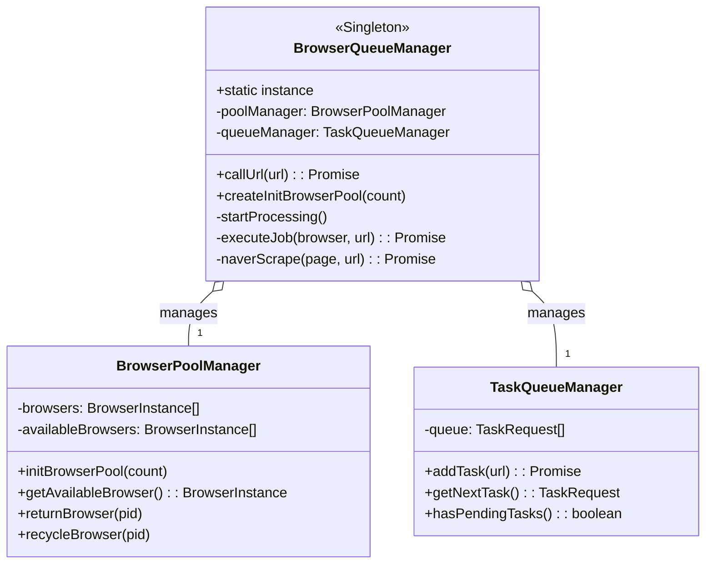
```mermaid
classDiagram
  direction TD
  class BrowserQueueManager {
    <<Singleton>>
    +static instance
    -poolManager: BrowserPoolManager
    -queueManager: TaskQueueManager
    +callUrl(url): Promise<JobResult>
    +createInitBrowserPool(count)
    -startProcessing()
    -executeJob(browser, url): Promise<JobResult>
    -naverScrape(page, url): Promise<JobResult>
  }
  class TaskQueueManager {
    -queue: TaskRequest[]
    +addTask(url): Promise<JobResult>
    +getNextTask(): TaskRequest
    +hasPendingTasks(): boolean
  }
  class BrowserPoolManager {
    -browsers: BrowserInstance[]
    -availableBrowsers: BrowserInstance[]
    +initBrowserPool(count)
    +getAvailableBrowser(): BrowserInstance
    +returnBrowser(pid)
    +recycleBrowser(pid)
  }

  BrowserQueueManager o-- "1" BrowserPoolManager : manages
  BrowserQueueManager o-- "1" TaskQueueManager : manages
```
Sources: [src/browser-queue-naver.ts:63-75](), [src/pool/task-pool.ts:13-39]()

## Request Handling and Processing Flow

When a scraping request is received at an API endpoint, the URL is added to the `TaskQueueManager`. The `BrowserQueueManager` runs a continuous processing loop that checks for pending tasks and available browsers. When both are available, it dequeues a task and assigns it to a browser from the pool for execution.

Sources: [src/scrape.ts:81](), [src/browser-queue-naver.ts:114-142]()

### Overall Flowchart

This diagram shows the high-level flow from an incoming API request to the completion of a scraping task.

```mermaid
graph TD
    A[HTTP GET Request to /] --> B{URL parameter valid?};
    B -- Yes --> C[callUrl(url) on BrowserQueueManager];
    C --> D[TaskQueueManager.addTask(url)];
    B -- No --> E[Return 400 Bad Request];
    D --> F{BrowserQueueManager Loop};
    F --> G{Pending Tasks AND Available Browser?};
    G -- Yes --> H[Get Next Task & Available Browser];
    H --> I[executeJob(browser, task)];
    I --> J{Scraping successful?};
    J -- Yes --> K[Return HTML content];
    J -- No --> L[Recycle Browser & Return Error];
    K --> M[Return Browser to Pool];
    L --> M;
    M --> F;
    G -- No --> F;
```
Sources: [src/scrape.ts:81-105](), [src/browser-queue-naver.ts:114-169]()

### Sequence of Operations

The sequence diagram below details the interactions between the main components when a new URL is requested for scraping.

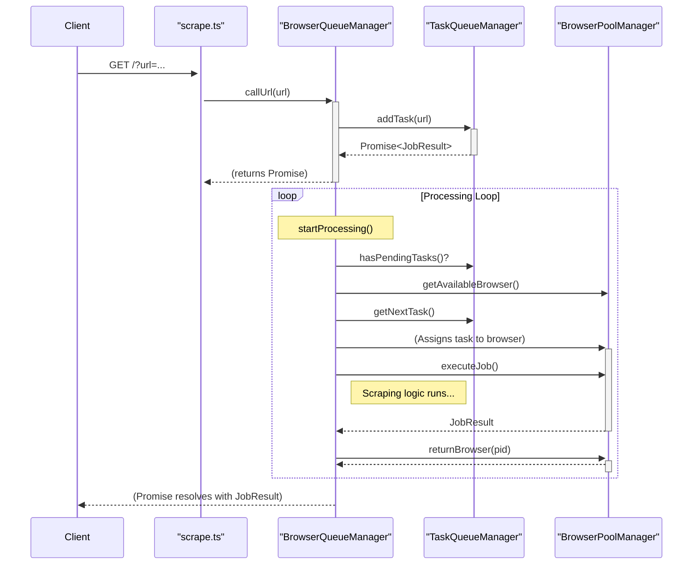
```mermaid
sequenceDiagram
  participant Client
  participant ExpressApp as "scrape.ts"
  participant BQM as "BrowserQueueManager"
  participant TQM as "TaskQueueManager"
  participant BPM as "BrowserPoolManager"

  Client->>+ExpressApp: GET /?url=...
  ExpressApp->>+BQM: callUrl(url)
  BQM->>+TQM: addTask(url)
  TQM-->>-BQM: Promise<JobResult>
  BQM-->>-ExpressApp: (returns Promise)

  loop Processing Loop
    Note over BQM: startProcessing()
    BQM->>TQM: hasPendingTasks()?
    BQM->>BPM: getAvailableBrowser()
    BQM->>TQM: getNextTask()
    BQM->>+BPM: (Assigns task to browser)
    BQM->>BPM: executeJob()
    Note right of BQM: Scraping logic runs...
    BPM-->>-BQM: JobResult
    BQM->>+BPM: returnBrowser(pid)
    BPM-->>-BQM:
  end

  BQM-->>Client: (Promise resolves with JobResult)
```
Sources: [src/scrape.ts:81](), [src/browser-queue-naver.ts:114-142, 85-98](), [src/pool/task-pool.ts:16-29]()

## Specialized Naver Scraping Logic

The currently active implementation, `BrowserQueueManager` in `browser-queue-naver.ts`, contains specialized logic for scraping Naver Smartstore and Brand Store pages. This is necessary to handle Naver's anti-bot measures and to extract product data that is often loaded dynamically via internal API calls.

Sources: [src/scrape.ts:23](), [src/browser-queue-naver.ts:246-250]()

### `naverScrape` Method

The core of this specialized logic resides in the `naverScrape` method. When a URL is identified as a Naver store page, this method is invoked instead of the default scraping process.

Its primary strategy involves:
1.  **Setting up an API Interceptor**: It listens for a specific network response from a Naver API endpoint (`/products/`) that contains the main product data.
2.  **Racing Navigation and API Response**: It uses `Promise.race` to wait for either the page navigation to complete or the target API data to be intercepted, whichever comes first. This is a performance optimization.
3.  **Data Extraction and Retry**: If the API data is not intercepted within the timeout, it triggers a retry mechanism (`fetchNaverDataInPage`) which simulates a user click and reloads the page to try and force the API call.
4.  **Returning Content**: It returns the full page HTML along with the intercepted API data and custom headers indicating the outcome.

The final status code is set to `429` if the crucial Naver API data could not be fetched, indicating a failure to the client.

```typescript
// src/browser-queue-naver.ts:262-264
private async naverScrape(pid: string, page: Page, url: string, addHeaders: Record<string, string>, interceptedData: Record<string, string>): Promise<JobResult> {
  // ...
}
```
Sources: [src/browser-queue-naver.ts:262-349]()

### Data Fetching Retry Mechanism

If the initial page load fails to capture the necessary API data, the `fetchNaverDataInPage` method is called. This function attempts to trigger the API call by programmatically clicking on the main content area of the page and then reloading it.

```typescript
// src/browser-queue-naver.ts:352-364
private async fetchNaverDataInPage(page: Page, originUrl: string, targetUrl: string) {
  await this.delay(1000); // 1000ms 대기
  console.log(`[${(new Date()).toLocaleString()}] 🚀 Click event triggered on #MAIN_CONTENT_ROOT_ID #2`)
  await page.evaluate(() => {
    // ✅ 버튼 클릭
    // @ts-ignore
    document.querySelector("#MAIN_CONTENT_ROOT_ID")?.click();
  });
  await this.delay(1000); // 1000ms 대기
  await page.evaluate(() => {
    location.reload();
  });
  console.log(`[${(new Date()).toLocaleString()}] 🚀 Location Reload triggered!`);
}
```
Sources: [src/browser-queue-naver.ts:300-308, 352-364]()

## API Endpoints

The Browser Queue Management system is consumed by several API endpoints defined in `scrape.ts`.

| Endpoint | Method | Description |
| :--- | :--- | :--- |
| `/` | `GET` | The main scraping endpoint. Takes a `url` query parameter, processes it through the queue, and returns the scraped HTML. It includes logic to handle Naver redirects before queueing. |
| `/check-naver-redirect` | `GET` | Specifically checks for and resolves Naver product page redirects. |
| `/scrape-detail` | `GET` | A scraping endpoint that returns additional headers (`x-sazo-status`, `x-sazo-append`) with metadata about the scrape job. |
| `/browsers` | `GET` | A monitoring endpoint that returns the status and configuration of the browser pool. |

Sources: [src/scrape.ts:79-138, 51-54]()

## Configuration

The system's behavior can be configured through environment variables and hardcoded constants.

| Parameter | Configuration | Description | Source |
| :--- | :--- | :--- | :--- |
| **Instance Number** | `INSTANCE_NUMBER` env var | Sets the number of concurrent browser instances in the pool. Defaults to 4. | `src/scrape.ts:28` |
| **Port** | Hardcoded constant | The Express server runs on port 3000. | `src/scrape.ts:27` |
| **Naver Redirect** | `activeScrapeNaverRedirect` flag | A boolean flag that enables or disables the pre-processing step for Naver redirect URLs. | `src/scrape.ts:32` |
| **Browser Rotation** | Automatic | Browser user-agent (desktop/mobile) is automatically switched every 30 minutes to avoid detection. | `CLAUDE.md` |

## Summary

The Browser Queue Management system provides a robust and scalable solution for web scraping, particularly tailored for the challenges of the Naver e-commerce platform. By pooling and queuing browser resources, it efficiently handles concurrent requests. Its specialized logic for Naver, including API interception and retry mechanisms, allows it to reliably extract data that would be inaccessible to simpler scrapers. The system is the backbone of the scraping service, exposed via a clear set of API endpoints for integration.

---

<a id='page-naver-scraping'></a>

## Naver Scraping Logic

### Related Pages

Related topics: [Browser Queue Management](#page-browser-queue), [Cookie Management](#page-cookie-management)

<details>
<summary>Relevant source files</summary>

The following files were used as context for generating this wiki page:

- [src/browser-queue-naver.ts](https://github.com/SAZO-KR/naver-parser/blob/main/src/browser-queue-naver.ts)
- [src/scrape.ts](https://github.com/SAZO-KR/naver-parser/blob/main/src/scrape.ts)
- [src/browser-queue.ts](https://github.com/SAZO-KR/naver-parser/blob/main/src/browser-queue.ts)
- [src/browser-cluster-20250428.ts](https://github.com/SAZO-KR/naver-parser/blob/main/src/browser-cluster-20250428.ts)
- [src/browser-queue-proxy.ts](https://github.com/SAZO-KR/naver-parser/blob/main/src/browser-queue-proxy.ts)
- [CLAUDE.md](https://github.com/SAZO-KR/naver-parser/blob/main/CLAUDE.md)
</details>

# Naver Scraping Logic

The Naver Scraping Logic is a specialized web scraping mechanism built with Puppeteer, designed specifically to handle the complexities of Naver's e-commerce platform, including Smart Store and Brand Store pages. It employs advanced techniques like request interception, DOM manipulation, and custom retry logic to reliably extract product data while bypassing common anti-bot measures. This system is integrated into an Express API server that manages a pool of browser instances to handle concurrent scraping requests.

The core of this logic resides within the browser queue management system, which differentiates between standard scraping tasks and those targeting Naver's platform. For Naver pages, it activates a unique set of procedures to capture internal API calls that contain structured product data, rather than relying solely on parsing the page's HTML content.

Sources: [CLAUDE.md](), [src/browser-queue.ts:80-82](), [src/browser-queue-naver.ts]()

## Architecture and Request Flow

The scraping process is initiated via an HTTP GET request to the Express server. The server then delegates the URL to a browser management module, which maintains a queue of scraping jobs and a pool of Puppeteer browser instances. Based on the URL, the manager decides whether to use a default scraping method or the specialized Naver scraping logic.

Sources: [src/scrape.ts:60-63](), [src/browser-queue.ts:80-84]()

### High-Level Request Flow

The following diagram illustrates the path of a scraping request from the client to the final response.

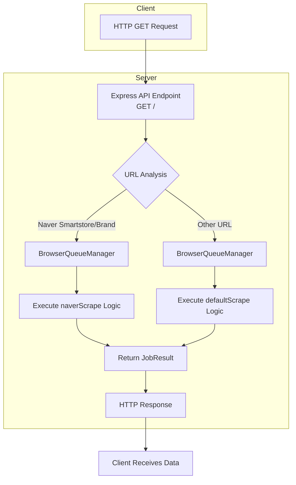
```mermaid
graph TD
    subgraph Client
        A[HTTP GET Request]
    end

    subgraph Server
        B[Express API Endpoint<br>GET /] --> C{URL Analysis};
        C -->|Naver Smartstore/Brand| D[BrowserQueueManager];
        C -->|Other URL| E[BrowserQueueManager];
        D --> F[Execute naverScrape Logic];
        E --> G[Execute defaultScrape Logic];
        F --> H[Return JobResult];
        G --> H;
        H --> I[HTTP Response];
    end

    A --> B;
    I --> J[Client Receives Data];
```
*Sources: [src/scrape.ts:60-77](), [src/browser-queue.ts:80-84]()*

## API Endpoints

The primary interaction with the scraping service is through its Express API endpoints.

| Method | Endpoint                  | Query Parameter | Description                                                                                                                              |
| :----- | :------------------------ | :-------------- | :--------------------------------------------------------------------------------------------------------------------------------------- |
| `GET`  | `/`                       | `url` (string)  | The main scraping endpoint. It takes a URL, processes it through the browser manager, and returns the scraped HTML and additional metadata. |
| `GET`  | `/check-naver-redirect`   | `url` (string)  | Specifically checks Naver URLs for redirects to find the final product page URL before initiating a full scrape.                            |
| `GET`  | `/health`                 | None            | A health check endpoint that returns the service status, boot time, and number of browser instances.                                       |
| `GET`  | `/scrape-detail`          | `url` (string)  | An alternative scraping endpoint that returns data in a JSON object.                                                                     |

*Sources: [src/scrape.ts:49-56, 60-63, 91-94, 114-117]()*

## Scraping Strategy Differentiation

The system employs a strategy pattern to handle different types of URLs. The `executeJob` method within the `BrowserQueueManager` inspects the URL to determine the appropriate scraping function to call.

-   **`isNaverSmartstoreSite(url)`**: Checks if the URL contains `smartstore.naver.com`.
-   **`isNaverBrandSite(url)`**: Checks if the URL contains `brand.naver.com`.

If either of these functions returns true, the `naverScrape` method is invoked; otherwise, the `defaultScrape` method is used.

*Sources: [src/browser-queue.ts:80-84, 57-65](), [src/browser-cluster-20250428.ts:114-124]()*

## Naver-Specific Scraping (`naverScrape`)

This is the core logic for handling Naver e-commerce pages. It focuses on intercepting an internal API call that fetches product details, as this provides a more reliable and structured source of data than parsing the HTML.

Sources: [src/browser-queue-naver.ts:153-242](), [src/browser-cluster-20250428.ts:126-215]()

### Sequence of Operations

The following diagram details the interactions during a `naverScrape` call.

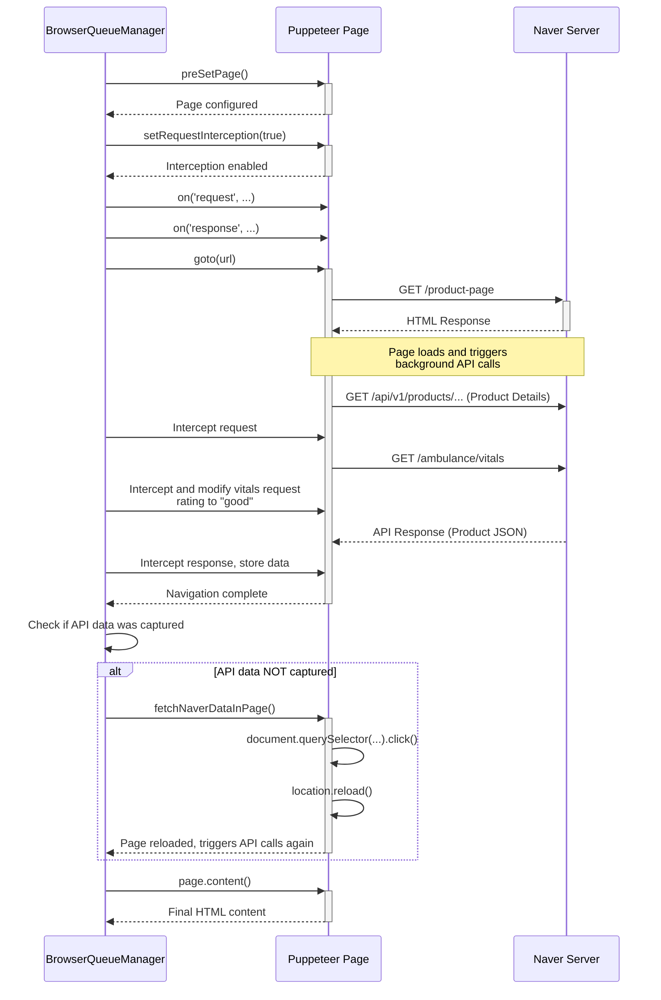
```mermaid
sequenceDiagram
    participant BQM as BrowserQueueManager
    participant Page as Puppeteer Page
    participant Naver as Naver Server

    BQM->>+Page: preSetPage()
    Page-->>-BQM: Page configured
    BQM->>+Page: setRequestInterception(true)
    Page-->>-BQM: Interception enabled
    BQM->>Page: on('request', ...)
    BQM->>Page: on('response', ...)
    BQM->>+Page: goto(url)
    Page->>+Naver: GET /product-page
    Naver-->>-Page: HTML Response
    Note over Page,Naver: Page loads and triggers<br>background API calls
    Page->>Naver: GET /api/v1/products/... (Product Details)
    BQM->>Page: Intercept request
    Page->>Naver: GET /ambulance/vitals
    BQM->>Page: Intercept and modify vitals request<br>rating to "good"
    Naver-->>Page: API Response (Product JSON)
    BQM->>Page: Intercept response, store data
    Page-->>-BQM: Navigation complete
    BQM->>BQM: Check if API data was captured
    alt API data NOT captured
        BQM->>+Page: fetchNaverDataInPage()
        Page->>Page: document.querySelector(...).click()
        Page->>Page: location.reload()
        Page-->>-BQM: Page reloaded, triggers API calls again
    end
    BQM->>+Page: page.content()
    Page-->>-BQM: Final HTML content
```
*Sources: [src/browser-queue-naver.ts:153-242](), [src/browser-queue-proxy.ts:141-229]()*

### Key Implementation Details

#### 1. Request Interception

Before navigating to the URL, Puppeteer's request interception is enabled. Listeners are set up for `request` and `response` events to monitor network traffic.

-   **Vitals Endpoint (`/ambulance/vitals`)**: The scraper specifically looks for requests to this endpoint, which appears to be a client-side health check or anti-bot measure. If the `rating` in the POST data is not "good", it is programmatically changed to "good" before the request is allowed to continue. This prevents Naver from detecting the scraper based on poor performance metrics.
-   **Product Details API**: The scraper listens for responses from URLs ending in `/api/v1/products/...`. When a response is captured, its JSON body is stored as the primary source of product data.

*Sources: [src/browser-queue-naver.ts:176-192](), [src/browser-queue-naver.ts:198-208](), [src/browser-cluster-20250428.ts:145-155]()*

#### 2. Retry Logic (`fetchNaverDataInPage`)

If the initial page load does not trigger the product details API call, a retry mechanism is initiated.

1.  A `2500ms` delay is introduced.
2.  A JavaScript evaluation (`page.evaluate`) triggers a click on the main content element (`#MAIN_CONTENT_ROOT_ID`).
3.  After another delay, the page is programmatically reloaded using `location.reload()`.

This sequence of actions simulates user interaction and is designed to force the product details API call if it was not made on the initial load.

*Sources: [src/browser-queue-naver.ts:245-257](), [src/browser-queue-proxy.ts:232-244]()*

### Response Augmentation

The result of a successful scrape includes not only the page's HTML but also custom headers and intercepted data that provide context about the scraping process.

| Header / Data Key      | Description                                                                                             |
| :--------------------- | :------------------------------------------------------------------------------------------------------ |
| `X-NAVER-DETAIL`       | (`true`/`false`) Indicates whether the structured product detail JSON was successfully captured.          |
| `X-NAVER-RETRY`        | (`true`/`false`) Indicates if the `fetchNaverDataInPage` retry logic was triggered.                     |
| `X-LAST-URL`           | The final URL of the page after any redirects.                                                          |
| `X-LAST-TITLE`         | The URL-encoded title of the final page.                                                                |
| `X-HTML-LENGTH`        | The length of the returned HTML content.                                                                |
| `interceptedData`      | An object containing the raw JSON string from the captured product details API (`naver_detail`).        |

*Sources: [src/browser-queue-naver.ts:224-240](), [src/browser-queue-proxy.ts:213-229]()*

## Error Handling and Status Codes

The system has specific error handling for scraping failures.

-   If the page content includes "비정상적 요청" (Abnormal Request), an `INVALID_REQUEST_RETURN` error is thrown, indicating that Naver has likely blocked the request.
-   If the product details API data (`naverApiData`) is not captured after all attempts, the HTTP status of the job result is set to `429` (Too Many Requests), signaling a likely rate-limiting or blocking issue.
-   If a page title indicates the product or store is no longer available, the retry mechanism is halted.

*Sources: [src/browser-queue-naver.ts:239-240, 216-218](), [src/browser-queue.ts:44-49]()*

---

<a id='page-cookie-management'></a>

## Cookie Management

### Related Pages

Related topics: [Naver Scraping Logic](#page-naver-scraping)

<details>
<summary>Relevant source files</summary>

The following files were used as context for generating this wiki page:

- [src/browser-queue-naver.ts](https://github.com/SAZO-KR/naver-parser/blob/main/src/browser-queue-naver.ts)
- [src/utils/cdp-cookie-controller.ts](https://github.com/SAZO-KR/naver-parser/blob/main/src/utils/cdp-cookie-controller.ts)
- [src/scrape-naver-redirect.ts](https://github.com/SAZO-KR/naver-parser/blob/main/src/scrape-naver-redirect.ts)
- [CLAUDE.md](https://github.com/SAZO-KR/naver-parser/blob/main/CLAUDE.md)
- [src/scrape.ts](https://github.com/SAZO-KR/naver-parser/blob/main/src/scrape.ts)
</details>

# Cookie Management

The cookie management system is a critical component of the `naver-parser` service, designed to handle Naver authentication and bypass anti-bot measures during web scraping. It automates the process of loading, saving, and deleting cookies to maintain valid sessions across multiple Puppeteer browser instances. The system primarily interacts with JSON files stored in the `cookies/` directory.

For advanced, low-level cookie manipulation, the service utilizes a `CdpCookieController` class, which interfaces directly with the Chrome DevTools Protocol (CDP). This allows for precise control over cookie properties, enabling sophisticated scraping strategies and diagnostics.

Sources: [CLAUDE.md](), [src/utils/cdp-cookie-controller.ts]()

## Core Functionality

The system's primary responsibilities include automatically loading existing session cookies into new browser pages, saving new authentication cookies when acquired, and clearing specific cookies that may trigger CAPTCHAs or other bot-detection mechanisms.

### Cookie Loading

Cookies are loaded from the local filesystem to establish an authenticated session for a Puppeteer page instance. The loading mechanism is designed to be resilient, proceeding without error if cookie files are not present.

The `loadCookies` function follows this process:
1.  Checks for the existence of the `cookies/` directory.
2.  Scans the directory for a file matching the pattern `naver-cookies-*.json`.
3.  If a matching file is found, it reads and parses the JSON content.
4.  The parsed cookies are then injected into the Puppeteer page using `page.setCookie()`.
5.  To prevent redundant operations, the system keeps track of the last loaded file path and skips reloading if the same file is targeted again.

Sources: [src/browser-queue-naver.ts:50-75]()

```mermaid
graph TD
    A[Start loadCookies] --> B{cookies/ directory exists?};
    B -- No --> C[Log warning and return];
    B -- Yes --> D{Find file matching 'naver-cookies-*.json'?};
    D -- No --> E[Log warning and return];
    D -- Yes --> F[Read and parse cookie file];
    F --> G{Is this file already loaded?};
    G -- Yes --> H[Log skip and return];
    G -- No --> I[page.setCookie(...cookies)];
    I --> J[Store file path as loaded];
    J --> K[Log success and return];
```
*A flowchart illustrating the cookie loading process.*
Sources: [src/browser-queue-naver.ts:50-75]()

### Cookie Saving

The system can capture and save new authentication cookies, which is particularly useful after a manual login or redirect that establishes a new session. The `saveCookies` function in `scrape-naver-redirect.ts` is responsible for this.

The saving process is triggered for Naver domains and includes the following steps:
1.  Retrieves all cookies from the current page.
2.  Verifies the presence of essential Naver authentication cookies, specifically `NID_AUT` and `NID_SES`. If they are missing, the process is aborted.
3.  Generates a SHA256 hash from the JSON content of the cookies to create a unique filename.
4.  If a file with the same hash already exists, the process stops to avoid creating duplicate files.
5.  Deletes all pre-existing `naver-cookies-*.json` files to ensure only the latest valid cookies are stored.
6.  Writes the new cookies to a file named `cookies/naver-cookies-{hash}.json`.

Sources: [src/scrape-naver-redirect.ts:133-169]()

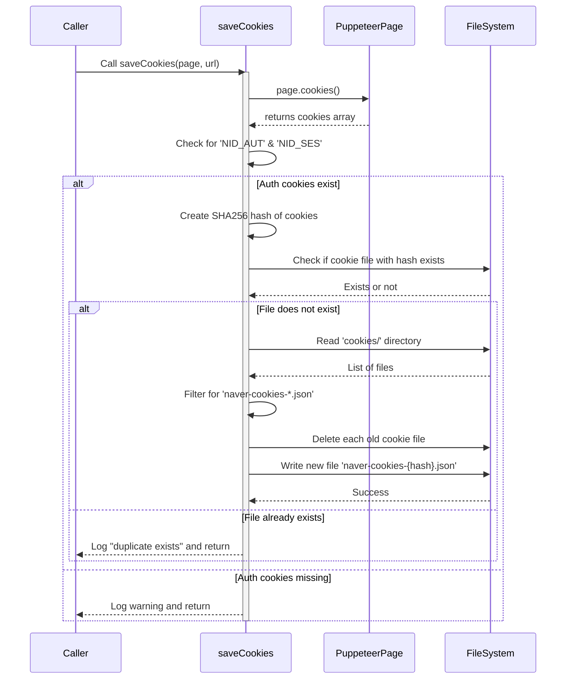
```mermaid
sequenceDiagram
    participant C as Caller
    participant S as saveCookies
    participant P as PuppeteerPage
    participant FS as FileSystem

    C->>S: Call saveCookies(page, url)
    activate S
    S->>P: page.cookies()
    P-->>S: returns cookies array
    S->>S: Check for 'NID_AUT' & 'NID_SES'
    alt Auth cookies exist
        S->>S: Create SHA256 hash of cookies
        S->>FS: Check if cookie file with hash exists
        FS-->>S: Exists or not
        alt File does not exist
            S->>FS: Read 'cookies/' directory
            FS-->>S: List of files
            S->>S: Filter for 'naver-cookies-*.json'
            S->>FS: Delete each old cookie file
            S->>FS: Write new file 'naver-cookies-{hash}.json'
            FS-->>S: Success
        else File already exists
            S-->>C: Log "duplicate exists" and return
        end
    else Auth cookies missing
        S-->>C: Log warning and return
    end
    deactivate S
```
*Sequence diagram for the `saveCookies` process.*
Sources: [src/scrape-naver-redirect.ts:133-169]()

### Cookie Deletion

To proactively manage anti-bot measures, the system includes functionality to delete specific cookies known to cause issues, such as those related to Naver's CAPTCHA system.

The `deleteNaverCaptchaCookies` function targets the `X-Wtm-Cpt-Tk` cookie across several Naver domains.

| Domain Target              | Cookie to Delete |
| -------------------------- | ---------------- |
| `brand.naver.com`          | `X-Wtm-Cpt-Tk`   |
| `m.brand.naver.com`        | `X-Wtm-Cpt-Tk`   |
| `smartstore.naver.com`     | `X-Wtm-Cpt-Tk`   |
| `m.smartstore.naver.com`   | `X-Wtm-Cpt-Tk`   |

This targeted deletion helps prevent scraping sessions from being interrupted by CAPTCHA challenges. The underlying `deleteSpecificCookies` function iterates through a map of domains and cookie names, collects all matching cookies, and removes them in a single `page.deleteCookie()` call.

Sources: [src/browser-queue-naver.ts:192-214](), [src/browser-queue-naver.ts:250-278]()

## Advanced Control with CDP

For more granular control, the `CdpCookieController` class provides a direct interface to the browser's cookie store via the Chrome DevTools Protocol (CDP). This allows for operations that are not available through the standard Puppeteer API.

Sources: [src/utils/cdp-cookie-controller.ts]()

### CdpCookieController Class

This class attaches to a Puppeteer page's CDP session to perform advanced cookie operations. It is used in specialized scraping scenarios, such as the `amazonJpScrape` function, to modify cookies before a page is loaded.

Key capabilities of the controller include:
-   Getting, setting, and deleting individual cookies with precise parameters.
-   Exporting all cookies to a JSON format.
-   Importing cookies from a JSON object.
-   Generating detailed statistics about the browser's cookie store.

The following code snippet shows how the controller is instantiated and used to delete a specific cookie:

```typescript
// src/browser-queue-naver.ts:316-320
const cookieController = new CdpCookieController(page);
const languageCookie = await cookieController.getCookie('lc-acbjp', '.amazon.co.jp');
if (languageCookie && languageCookie.value !== 'ja_JP') {
  console.log(`[${(new Date()).toLocaleString()}] [${pid}] [${url}] Removing lc-acbjp cookie...`);
  await cookieController.deleteCookie({name:'lc-acbjp', domain:'.amazon.co.jp'});
}
```
Sources: [src/utils/cdp-cookie-controller.ts](), [src/browser-queue-naver.ts:316-320]()

### Key Operations

The `CdpCookieController` class exposes several methods for fine-grained cookie management.

| Method                  | Description                                                                          |
| ----------------------- | ------------------------------------------------------------------------------------ |
| `getAllCookies()`       | Retrieves all cookies from the browser context.                                      |
| `getCookie(name, domain)` | Finds and returns a single cookie matching the specified name and domain.            |
| `setCookie(request)`    | Sets a cookie with detailed parameters like `httpOnly`, `secure`, and `sameSite`.    |
| `deleteCookie(request)` | Deletes a cookie matching the specified name and domain.                             |
| `exportCookies(filter)` | Exports cookies to a JSON array, optionally filtered by domain.                      |
| `importCookies(cookies)`| Imports an array of cookies into the browser.                                        |
| `getCookieStats()`      | Returns statistics, including total count, counts by domain, and counts by property. |
| `printDetailedCookieInfo()` | Logs a detailed, human-readable list of all cookies and their properties to the console. |

Sources: [src/utils/cdp-cookie-controller.ts]()

## Summary

The cookie management system in `naver-parser` is a two-tiered solution. It provides high-level, automated file-based cookie persistence for routine Naver scraping tasks, ensuring sessions remain authenticated. For complex scenarios requiring precise control, it offers a low-level CDP-based controller, enabling developers to script sophisticated cookie manipulations to overcome advanced anti-scraping defenses. This dual approach is fundamental to the scraper's robustness and reliability.

---

<a id='page-deployment-pm2'></a>

## Deployment with PM2

### Related Pages

Related topics: [Getting Started](#page-getting-started), [Configuration](#page-configuration)

<details>
<summary>Relevant source files</summary>
The following files were used as context for generating this wiki page:

- [ecosystem.config.js](https://github.com/SAZO-KR/naver-parser/blob/main/ecosystem.config.js)
- [package.json](https://github.com/SAZO-KR/naver-parser/blob/main/package.json)
- [CLAUDE.md](https://github.com/SAZO-KR/naver-parser/blob/main/CLAUDE.md)
- [src/scrape.ts](https://github.com/SAZO-KR/naver-parser/blob/main/src/scrape.ts)
- [src/main.ts](https://github.com/SAZO-KR/naver-parser/blob/main/src/main.ts)
</details>

# Deployment with PM2

This document outlines the use of PM2 (Process Manager 2) for deploying and managing the Naver web scraping service. PM2 is responsible for running the application in a production environment, ensuring it remains active, handling restarts, and managing logs. The core of the scraping functionality is the Express server defined in `src/scrape.ts`, which is the target script for PM2.

The configuration for PM2 is centralized in `ecosystem.config.js`, which defines application-specific settings like the script to run, memory limits, and logging behavior. A set of npm scripts in `package.json` provides a convenient command-line interface for developers to interact with the PM2-managed processes, simplifying tasks like starting, stopping, and updating the service.

Sources: [ecosystem.config.js](), [package.json:5-18](), [CLAUDE.md:23](), [src/scrape.ts:11-30]()

## PM2 Configuration

The primary configuration for PM2 is located in `ecosystem.config.js`. This file defines an application named `scrape` that runs the compiled TypeScript code.

Sources: [ecosystem.config.js]()

### Configuration File

The complete PM2 configuration is as follows:

```javascript
// ecosystem.config.js
const moment = require("moment")
const path = require("path");

module.exports = {
  apps: [
    {
      name: 'scrape',
      script: 'dist/scrape.js',
      instances: 1,
      exec_mode: 'fork',
      log_file: path.join(__dirname, "logs", "log_file.log"),
      out_file: path.join(__dirname, "logs", "out_file.log"),
      error_file: path.join(__dirname, "logs", "error_file.log"),
      log_date_format: 'YYYY-MM-DD HH:mm:ss',
      autorestart: true,
      watch: false,
      max_memory_restart: '800M',
    }
  ],
}
```
Sources: [ecosystem.config.js:1-24]()

### Configuration Parameters

The table below details the key configuration options set for the `scrape` application.

| Parameter | Value | Description |
| :--- | :--- | :--- |
| `name` | `'scrape'` | The name of the application process managed by PM2. |
| `script` | `'dist/scrape.js'` | The entry point script for the application. This is the compiled version of `src/scrape.ts`. |
| `instances` | `1` | The number of application instances to be launched. |
| `exec_mode` | `'fork'` | The execution mode for the application. `fork` mode is standard for Node.js applications. |
| `log_file` | `path.join(__dirname, "logs", "log_file.log")` | Combined path for all log types. |
| `out_file` | `path.join(__dirname, "logs", "out_file.log")` | Path for standard output logs. |
| `error_file` | `path.join(__dirname, "logs", "error_file.log")` | Path for error logs. |
| `log_date_format` | `'YYYY-MM-DD HH:mm:ss'` | The timestamp format for logs. |
| `autorestart` | `true` | Automatically restarts the application if it crashes or exits. |
| `watch` | `false` | Disables automatic restart on file changes. |
| `max_memory_restart` | `'800M'` | Automatically restarts the application if it reaches this memory limit. |

Sources: [ecosystem.config.js:8-21](), [CLAUDE.md:23]()

## Process Management Scripts

The `package.json` file contains several npm scripts that act as wrappers around PM2 commands, providing a standardized way to manage the application lifecycle.

Sources: [package.json:5-18](), [CLAUDE.md:27-55]()

### Command Summary

| Script | Command | Description |
| :--- | :--- | :--- |
| `start` | `yarn tsc && pm2 start ecosystem.config.js` | Compiles the TypeScript source code and starts the `scrape` application using PM2. |
| `stop` | `pm2 delete scrape` | Stops and removes the `scrape` application from the PM2 process list. |
| `stop:force` | `pm2 delete scrape --force` | Forcefully stops and removes the `scrape` application. |
| `show` | `pm2 show scrape` | Displays detailed information about the `scrape` application process. |
| `update` | `git pull && yarn install && yarn stop && yarn start` | Pulls the latest code, installs dependencies, and restarts the service. |
| `kill` | `pm2 kill` | Kills the PM2 daemon itself. |
| `log:search` | `pm2 logs search --lines 1000` | Shows the last 1000 lines of logs for the `search` process (Note: `ecosystem.config.js` only defines `scrape`). |

Sources: [package.json:8-18](), [CLAUDE.md:36-52]()

### Management Flow

The following diagram illustrates the interaction between a developer, npm scripts, PM2, and the Node.js application.

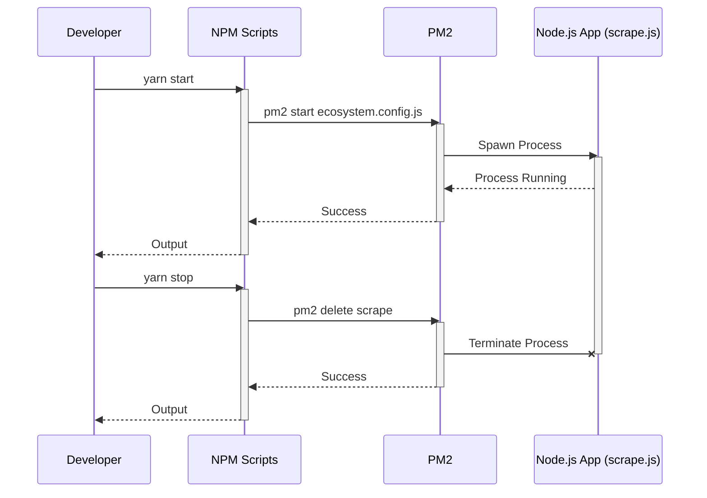
```mermaid
sequenceDiagram
    participant Developer
    participant NPM Scripts
    participant PM2
    participant Node.js App (scrape.js)

    Developer->>NPM Scripts: yarn start
    activate NPM Scripts
    NPM Scripts->>PM2: pm2 start ecosystem.config.js
    activate PM2
    PM2->>Node.js App (scrape.js): Spawn Process
    activate Node.js App (scrape.js)
    Node.js App (scrape.js)-->>PM2: Process Running
    PM2-->>NPM Scripts: Success
    deactivate PM2
    NPM Scripts-->>Developer: Output
    deactivate NPM Scripts

    Developer->>NPM Scripts: yarn stop
    activate NPM Scripts
    NPM Scripts->>PM2: pm2 delete scrape
    activate PM2
    PM2-xNode.js App (scrape.js): Terminate Process
    deactivate Node.js App (scrape.js)
    PM2-->>NPM Scripts: Success
    deactivate PM2
    NPM Scripts-->>Developer: Output
    deactivate NPM Scripts
```
Sources: [package.json:8-18](), [ecosystem.config.js:8-21]()

## Deployment and Update Workflow

The `update` script in `package.json` defines the standard procedure for deploying updates to the service. This workflow ensures that the latest code is fetched, dependencies are updated, and the application is restarted cleanly.

The main server application, which acts as a proxy, is defined in `src/main.ts` and runs on port 80, forwarding requests to the scraper service. However, the PM2 configuration specifically manages the `scrape` service.

Sources: [package.json:15](), [src/main.ts:1-29]()

### Update Process Flow

This diagram shows the sequence of events when the `yarn update` command is executed.

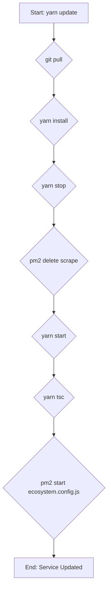
```mermaid
graph TD
    A[Start: yarn update] --> B{git pull};
    B --> C{yarn install};
    C --> D{yarn stop};
    D --> E{pm2 delete scrape};
    E --> F{yarn start};
    F --> G{yarn tsc};
    G --> H{pm2 start ecosystem.config.js};
    H --> I[End: Service Updated];
```
Sources: [package.json:8,11,15]()

## Logging and Monitoring

Logging is handled directly by PM2 as configured in `ecosystem.config.js`. All logs are directed to the `logs/` directory at the project root.

- **Standard Output:** `logs/out_file.log`
- **Error Output:** `logs/error_file.log`
- **Combined Logs:** `logs/log_file.log`

The logs are timestamped with the format `YYYY-MM-DD HH:mm:ss`.

For real-time monitoring, developers can use the commands listed in `CLAUDE.md`:
- `pm2 logs scrape`: To view live logs for the `scrape` process.
- `pm2 monit`: To open a real-time monitoring dashboard in the terminal.

Sources: [ecosystem.config.js:15-18](), [CLAUDE.md:46-47]()

## Summary

The project leverages PM2 as a robust process manager for the production environment. The deployment is streamlined through a combination of the `ecosystem.config.js` file and a set of purpose-built npm scripts. This setup provides process stability via auto-restarts on crashes or memory limits, centralized log management, and a simple, one-command workflow for deploying updates.

---

<a id='page-configuration'></a>

## Configuration

### Related Pages

Related topics: [Deployment with PM2](#page-deployment-pm2)

<details>
<summary>Relevant source files</summary>
The following files were used as context for generating this wiki page:

- [ecosystem.config.js](https://github.com/SAZO-KR/naver-parser/blob/main/ecosystem.config.js)
- [src/scrape.ts](https://github.com/SAZO-KR/naver-parser/blob/main/src/scrape.ts)
- [CLAUDE.md](https://github.com/SAZO-KR/naver-parser/blob/main/CLAUDE.md)
- [package.json](https://github.com/SAZO-KR/naver-parser/blob/main/package.json)
- [src/browser-queue-naver.ts](https://github.com/SAZO-KR/naver-parser/blob/main/src/browser-queue-naver.ts)
</details>

# Configuration

This document provides a comprehensive overview of the configuration settings for the `naver-parser` service. The project's configuration is managed through a combination of a PM2 ecosystem file, environment variables, hardcoded constants within the source code, and script definitions in `package.json`. These configurations control process management, server behavior, and scraping parameters.

Sources: [CLAUDE.md](), [ecosystem.config.js](), [src/scrape.ts]()

## Process Management (PM2)

The application uses PM2 for process management in production. The configuration is defined in `ecosystem.config.js` and is initiated via the `yarn start` script. This setup ensures the application runs continuously, restarts on failure or memory limits, and manages logging.

Sources: [ecosystem.config.js](), [package.json:7](), [CLAUDE.md:32]()

### PM2 Application Settings

The core settings for the `scrape` application process are detailed below.

| Parameter | Value | Description |
| :--- | :--- | :--- |
| `name` | `'scrape'` | The name of the application process managed by PM2. |
| `script` | `'dist/scrape.js'` | The entry point script for the application after TypeScript compilation. |
| `instances` | `1` | The number of application instances to be launched. |
| `exec_mode` | `'fork'` | The execution mode for the application. |
| `log_file` | `logs/log_file.log` | The path to the combined log file. |
| `out_file` | `logs/out_file.log` | The path for standard output logs. |
| `error_file` | `logs/error_file.log` | The path for error logs. |
| `log_date_format`| `'YYYY-MM-DD HH:mm:ss'` | The format for timestamps in the logs. |
| `autorestart` | `true` | Enables automatic restart of the process if it crashes. |
| `max_memory_restart`| `'800M'` | The memory limit at which the application will be automatically restarted. |

Sources: [ecosystem.config.js:14-26]()

The following diagram illustrates the PM2 process management flow based on the configuration.

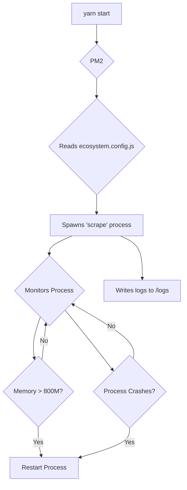
```mermaid
graph TD
    A[yarn start] --> B{PM2};
    B --> C{Reads ecosystem.config.js};
    C --> D[Spawns 'scrape' process];
    D --> E{Monitors Process};
    E --> F{Memory > 800M?};
    F -- Yes --> G[Restart Process];
    F -- No --> E;
    E --> H{Process Crashes?};
    H -- Yes --> G;
    H -- No --> E;
    D --> I[Writes logs to /logs];
```
*Diagram illustrating the PM2 process lifecycle.*
Sources: [ecosystem.config.js:14-26](), [package.json:7]()

## Application Server Configuration

The Express server configuration is primarily defined within `src/scrape.ts`. It includes settings for the server port, the number of browser instances, and feature flags.

Sources: [src/scrape.ts]()

### Server Constants and Environment Variables

| Setting | Type | Value / Default | Description | Source File |
| :--- | :--- | :--- | :--- | :--- |
| `PORT` | Constant | `3000` | The hardcoded port on which the Express server listens. | `src/scrape.ts:71` |
| `INSTANCE_NUMBER` | Environment Variable | `4` | The number of Puppeteer browser instances to manage in the pool. Overridden by the `INSTANCE_NUMBER` environment variable. | `src/scrape.ts:72`, `CLAUDE.md:43` |
| `activeScrapeNaverRedirect`| Constant | `true` | A boolean flag that enables or disables the pre-scraping check for Naver product URL redirects. | `src/scrape.ts:75` |

### Server Endpoints

The service exposes several HTTP endpoints to control the scraping process and monitor health.

| Method | Path | Description |
| :--- | :--- | :--- |
| `GET` | `/health` | A health check endpoint that returns the server status, boot time, and instance count. |
| `GET` | `/` | The main scraping endpoint. Requires a `url` query parameter. It is protected by a rate limiter. |
| `GET` | `/check-naver-redirect` | An endpoint specifically for checking Naver redirect URLs. Requires a `url` query parameter. |
| `GET` | `/scrape-detail` | An alternative scraping endpoint. |
| `GET` | `/browsers` | Returns information about the managed browser instances. |

Sources: [src/scrape.ts:83-149]()

The sequence diagram below shows the flow for a standard scraping request to the `/` endpoint.

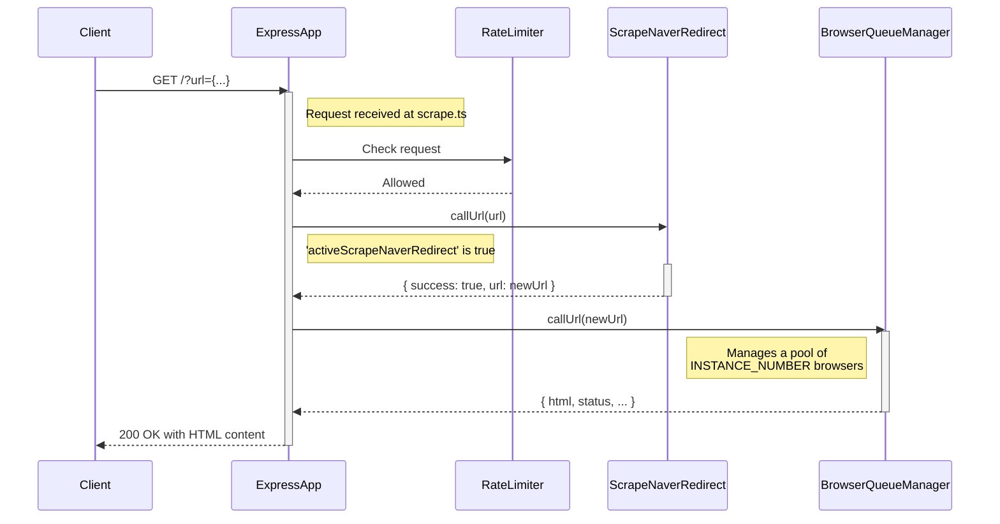
```mermaid
sequenceDiagram
    participant Client
    participant ExpressApp
    participant RateLimiter
    participant ScrapeNaverRedirect
    participant BrowserQueueManager

    Client->>ExpressApp: GET /?url={...}
    activate ExpressApp
    Note right of ExpressApp: Request received at scrape.ts
    ExpressApp->>RateLimiter: Check request
    RateLimiter-->>ExpressApp: Allowed
    ExpressApp->>ScrapeNaverRedirect: callUrl(url)
    Note right of ExpressApp: 'activeScrapeNaverRedirect' is true
    activate ScrapeNaverRedirect
    ScrapeNaverRedirect-->>ExpressApp: { success: true, url: newUrl }
    deactivate ScrapeNaverRedirect
    ExpressApp->>BrowserQueueManager: callUrl(newUrl)
    activate BrowserQueueManager
    Note left of BrowserQueueManager: Manages a pool of<br>INSTANCE_NUMBER browsers
    BrowserQueueManager-->>ExpressApp: { html, status, ... }
    deactivate BrowserQueueManager
    ExpressApp-->>Client: 200 OK with HTML content
    deactivate ExpressApp
```
*Sequence diagram for a request to the main scraping endpoint.*
Sources: [src/scrape.ts:94-113](), [src/scrape.ts:72](), [src/scrape.ts:75]()

## Scraping Engine Configuration

The core scraping logic has several configurable aspects related to browser behavior and authentication.

Sources: [CLAUDE.md](), [src/browser-queue-naver.ts]()

| Feature | Configuration | Description |
| :--- | :--- | :--- |
| **Cookie Management** | Place files in `cookies/` directory | Authentication cookies for Naver are automatically loaded from JSON files matching the pattern `naver-cookies-*.json`. |
| **Browser Rotation** | Automatic every 30 minutes | Browser instances automatically switch between desktop and mobile user-agents every 30 minutes to avoid detection. |
| **Browser Recycling** | Automatic on error or after 30 minutes | Browser instances are completely recycled (closed and re-launched) after 30 minutes of use or if an error occurs during a job. |
| **Request Interception**| Hardcoded logic | The scraper intercepts specific Naver API calls (`/v2/channels/.../products/...`) to capture detailed product data. |

Sources: [CLAUDE.md:25, 45-46](), [src/browser-queue-naver.ts]()

## Development and Deployment Scripts

The `package.json` file defines a set of `yarn` scripts for managing the application lifecycle, including development, building, and production deployment.

Sources: [package.json:5-15]()

| Script | Command | Description |
| :--- | :--- | :--- |
| `build` | `yarn tsc` | Compiles the TypeScript source code into JavaScript in the `dist/` directory. |
| `dev:scrape` | `yarn nodemon --ignore cookies/ src/scrape.ts` | Runs the main scraping server in development mode using `nodemon`, which automatically restarts on file changes. Ignores changes in the `cookies/` directory. |
| `start` | `yarn tsc && pm2 start ecosystem.config.js` | Builds the project and starts it in production mode using the PM2 configuration file. |
| `stop` | `pm2 delete scrape` | Stops the `scrape` application process managed by PM2. |
| `show` | `pm2 show scrape` | Displays detailed information about the running `scrape` process. |
| `update` | `git pull && yarn install && yarn stop && yarn start` | Pulls the latest code from the git repository, installs dependencies, and restarts the application via PM2. |
| `kill` | `pm2 kill` | Kills the PM2 daemon itself. |

Sources: [package.json:5-15](), [CLAUDE.md:32-41]()

## Summary

The configuration of the `naver-parser` is multifaceted, relying on PM2 for robust process management, environment variables for scalability, and in-code constants for stable server settings. The `package.json` scripts provide a convenient and standardized way to interact with the application across different environments. This layered approach allows for both flexibility in deployment and stability in operation.

---

